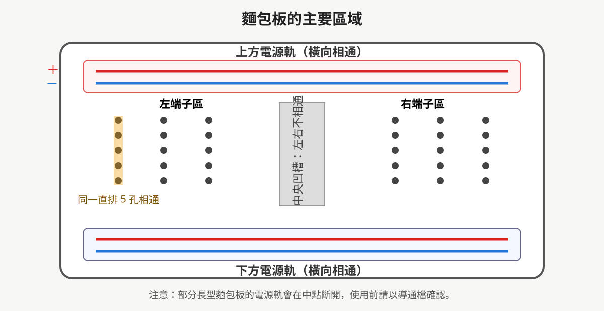
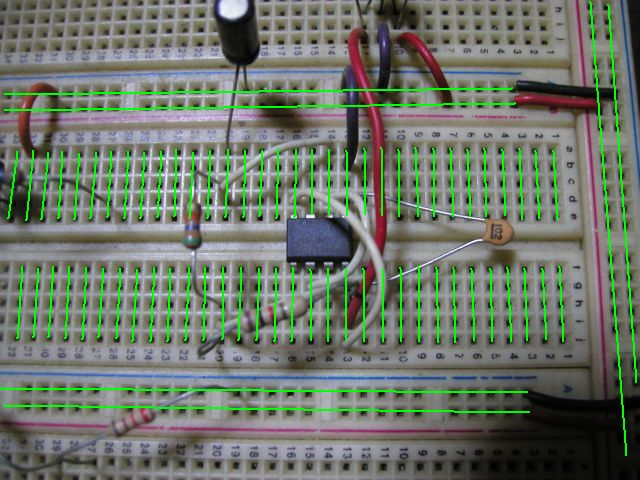
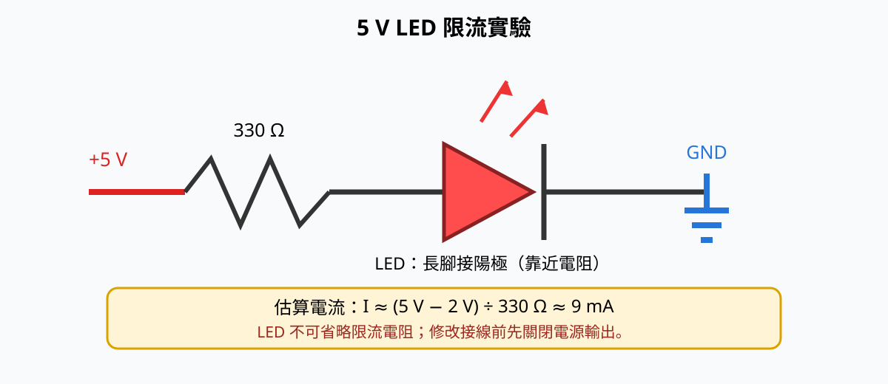
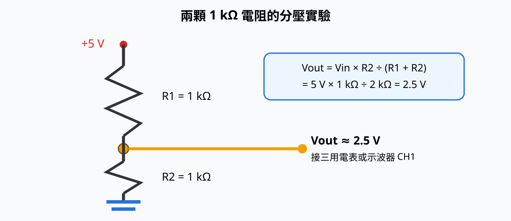

# 電子學實習 — 第一次上課：基本儀器操作教學

> 課程時數：4 小時
> 適用設備：
> - 示波器：**固緯 GWinstek GDS-1072A-U**（70 MHz / 2 通道 / 1 GSa/s 即時取樣）
> - 函數波信號產生器：**固緯 GWinstek AFG-2112**（12 MHz / 雙通道）
> - 直流電源供應器：**固緯 GWinstek GPD-4303S**（四輸出 / 可程式線性電源）

---

## 一、課程目標

1. 認識三種基本儀器的面板與各接頭功能。
2. 學會獨立操作儀器，能產生、量測並供應基本電信號。
3. 完成三項實作：電源供電、信號產生、波形觀測。
4. 建立安全操作觀念（避免短路、過載、誤接）。

---

## 二、安全守則

- 開機前確認所有 **輸出旋鈕/按鈕處於 OFF**，接線完成後再送電。
- 電源供應器：先設好電壓電流再接負載，**電流上限(CC)一定要設**，避免短路燒毀。
- 信號產生器輸出為低電壓（一般 < 20 Vpp），不可直接驅動大電流負載。
- 示波器探棒接地夾 **不可碰觸帶電高壓或不同電位的地**，以免短路。
- 量測市電(110V/220V)前務必請老師確認。
- 操作完畢：先關輸出，再關機，最後整理線材。

---

## 三、麵包板基礎操作

### 3.1 麵包板是什麼？

麵包板（solderless breadboard）是一種**不需焊接**的電路實驗平台。將元件接腳與跳線插入孔洞，就能快速搭建、修改與拆除電路，很適合低電壓電子實習與原型測試。

麵包板可分成三個主要部分：

- **電源軌（Power Rails）**：通常位於上下兩側，以紅色 `+`、藍色或黑色 `−` 標示，供應電源與接地。一般沿長邊相通，但部分長型麵包板會在中間斷開。
- **端子區（Terminal Strips）**：中央兩側的孔洞通常每 5 孔為一組，組內相通；相鄰組彼此不相通。
- **中央凹槽（Center Gap）**：左右兩側不相通，DIP 封裝 IC 應跨在凹槽上，使兩排接腳分開。

> **重要：**不同品牌的內部連接方式可能略有差異。第一次使用前，應先用三用電表的導通蜂鳴檔確認，不可只憑紅、藍線或外觀判斷。

### 3.2 內部為什麼會導通？

孔洞下方裝有成排的金屬彈片。元件腳插入後會被彈片夾住，同一片金屬導片所連接的孔洞便具有相同電位。

> 圖片來源：Chuck，Wikimedia Commons，公有領域（Public Domain）。

### 3.3 上電前先做導通測試

1. 確認電源供應器 **OUTPUT 關閉**，麵包板不可帶電。
2. 三用電表切到導通蜂鳴檔。
3. 兩支表筆分別接觸同一組的兩個孔，蜂鳴代表相通。
4. 改測相鄰兩組、中央凹槽兩側，正常情況下不應蜂鳴。
5. 測試電源軌的頭、尾兩端，確認電源軌是否在中點斷開；若斷開，需以跳線跨接。

### 3.4 元件插接原則

- 元件接腳應插入**不同的導通組**，否則兩端會被短接。例如電阻兩腳不可插在同一組 5 孔內。
- DIP IC 必須跨過中央凹槽，並先確認缺口或第 1 腳方向。
- LED 有極性：一般長腳為陽極（A），短腳與外殼平邊一側為陰極（K）。
- 跳線應貼近板面並使用容易辨識的顏色；建議紅色代表正電源、黑色或藍色代表 GND。
- 不可硬插過粗、彎曲或沾錫過多的接腳，以免撐鬆金屬彈片。
- 每次改線前先關閉電源輸出；完成後逐點檢查，再開啟 OUTPUT。

### 3.5 簡單範例一：5 V 點亮 LED

**器材：**麵包板、LED ×1、330 Ω 電阻 ×1、跳線、5 V 直流電源。

1. 關閉電源 OUTPUT，將 `+5 V` 與 `GND` 分別接到麵包板的正、負電源軌。
2. 將 330 Ω 電阻的一端接正電源軌，另一端接到一組未使用的端子孔。
3. LED 長腳（陽極）與電阻接在同一組相通孔；LED 短腳（陰極）接到另一組孔。
4. 用跳線將 LED 陰極所在孔組接到 GND 電源軌。
5. 電源設定為 5.00 V、限流 20 mA，檢查無短路後開啟 OUTPUT。
6. LED 應亮起。若不亮，先關閉 OUTPUT，再檢查極性、孔位與電源軌是否中斷。

若紅色 LED 順向壓降約為 2 V，電流約為：

`I = (5 V − 2 V) / 330 Ω ≈ 9 mA`

> **禁止將 LED 不經限流電阻直接接到 5 V**，否則可能因電流過大而損壞。

### 3.6 簡單範例二：兩顆電阻分壓

**器材：**1 kΩ 電阻 ×2、跳線、5 V 直流電源、三用電表或示波器。

1. 關閉電源 OUTPUT，將兩顆 1 kΩ 電阻串聯在 `+5 V` 與 `GND` 之間。
2. 兩顆電阻的連接點為輸出 `Vout`。
3. 開啟電源後，以三用電表量測 `Vout` 對 GND，理論值約為 2.5 V。
4. 也可將示波器 CH1 探棒尖端接 `Vout`、接地夾接 GND，練習量測直流準位。

分壓公式為：

`Vout = Vin × R2 / (R1 + R2) = 5 V × 1 kΩ / (1 kΩ + 1 kΩ) = 2.5 V`

### 3.7 麵包板常見錯誤

| 現象 | 可能原因 | 處理方式 |
|------|----------|----------|
| 電路完全不動作 | 電源軌中間斷開 | 用導通檔確認，必要時加跨接線 |
| 元件兩端電壓為 0 V | 兩腳誤插在同一組相通孔 | 將其中一腳移到另一組孔 |
| LED 不亮 | LED 反接或未形成回路 | 關閉電源後確認長短腳與 GND |
| 電源進入 CC、電壓下降 | 正負電源短路或接線錯誤 | 立即關閉 OUTPUT，逐段檢查 |
| 接觸時好時壞 | 接腳太細、孔洞鬆動或跳線未插到底 | 更換孔位或合格實心跳線 |

---

## 四、儀器面板重點介紹

### 4.1 直流電源供應器 GPD-4303S
- **四組獨立隔離輸出**：CH1、CH2 為可調（0–30 V / 0–3 A）；CH3 固定 5 V / 3 A；CH4 輔助 5 V / 1 A，總功率 195 W。
- 解析度 1 mV / 1 mA，具 Tracking（串/並聯）、Save/Recall、USB 遠控。
- **CV / CC 指示燈**：恆壓(CV)或恆流(CC)模式，可判斷是否過載。
- **Tracking 功能**：可串/並聯 CH1+CH2 取得更高電壓或大電流。
- **輸出開關**：OUTPUT 按鈕，記得按亮才會有輸出。

### 4.2 函數波信號產生器 AFG-2112
- **雙通道 CH1 / CH2**，頻率最高 12 MHz。
- 波形：正弦、方波、三角波、脈波、鋸齒波、雜訊、ARB（任意波）。
- **振幅(AMPL)**：可切 Vpp / Vrms，注意負載 50Ω / Hi-Z 對實際輸出有影響。
  - **影響**：信號產生器內部輸出級設計為「額定接 50Ω 負載時，開路(Hi-Z)端電壓會變成設定值的两倍」。例如設 2 Vpp 且選 50Ω 負載，接上 50Ω 時量到 2 Vpp；若改接高阻抗(如示波器 1 MΩ 輸入、Hi-Z)，實際開路電壓會達約 4 Vpp。反之若儀器設 Hi-Z 但實際接 50Ω 負載，輸出會只剩約一半。
  - **用在什麼地方**：連接同軸線路、射頻模組、需要阻抗匹配的量測（如網路分析、高頻傳輸）時要選 50Ω；接一般電路、運算放大器、示波器高阻輸入做普通觀測時選 Hi-Z。設定(LOAD)必須與實際負載一致，量到的振幅才正確。
- **偏移(OFFSET)**：直流準位偏移。
- 具 AM / FM / FSK / 掃頻等調變功能（本次先不操作）。

### 4.3 數位示波器 GDS-1072A-U
- **2 通道輸入 CH1 / CH2**，頻寬 70 MHz，隨附 70 MHz 被動探棒（GTP-070A-4，10×/1× 切換）。
- 垂直：VOLTS/DIV（靈敏度）、POSITION（位移）。
- 水平：TIME/DIV（時基）、POSITION。
- TRIGGER：設定觸發源(CH1/CH2)、邊緣、準位，穩定波形。
- 自動量測：按 `MEASURE` 可讀 Vpp、Vavg、頻率、週期等。
- `AUTO SET`：一鍵自動設定，初學者好用。

---

## 五、單元一：直流電源供應器（實作）

### 實作 1-1：輸出 5 V 固定電壓
1. 確認 OUTPUT 關閉（未按亮）。
2. 選 CH1，按 `VOLTAGE` 旋鈕設定為 **5.00 V**。
3. 按 `CURRENT` 旋鈕設定電流上限為 **0.5 A**（保護用）。
4. 用三用電表（或待會的示波器）量測 + / − 端子。
5. 按亮 OUTPUT，確認面板顯示 5.00 V 且 CV 燈亮。
6. 用導線接一顆 1 kΩ 電阻，量測電流約 5 mA（I = 5 V / 1 kΩ）。

### 實作 1-2：認識 CV / CC 模式
1. 將電流上限設為 **0.05 A (50 mA)**。
2. 接上 100 Ω 電阻（預期電流 50 mA），觀察進入 CC 模式（CC 燈亮、電壓下降）。
3. 紀錄：電壓與電流讀數，理解過載限流保護。

### 實作 1-3：Tracking 串/並聯運用
- **串聯(Series)**：將 CH1、CH2 設為 Track Series，可得較高電壓（如 ±15 V 對稱雙電源，供運算放大器使用）。
- **並聯(Parallel)**：將 CH1、CH2 設為 Track Parallel，可得較大電流輸出（同電壓但總電流為兩通道之和）。
- 操作要點：先確認兩通道電壓/電流設定一致，再切換 Tracking 模式，避免不均流或環流。

---

## 六、單元二：函數波信號產生器（實作）

### 實作 2-1：產生 1 kHz 正弦波
1. 按 `Sine`（正弦波）。
2. 設定頻率 **1.000 kHz**（用數字鍵或旋鈕）。
3. 設定振幅 **2.00 Vpp**（按 AMPL，選 Vpp）。
4. 切換單位設定為 **Vrms**，確認顯示約 **0.707 Vrms**（正弦波 Vrms = Vpp / 2√2）。
5. 設 OFFSET = 0 V。
6. 按 CH1 的 OUTPUT 開啟。
7. 用三用電表 AC 檔確認約 0.707 Vrms，並對照 Vpp 與 Vrms 的換算關係。

### 實作 2-2：切換波形比較
- 分別產生 **方波、三角波**，設定同頻率同振幅，觀察差異（後續用示波器看）。

### 實作 2-3：雙通道與相位
- CH1 設 1 kHz 正弦波，CH2 設 1 kHz 方波，練習兩通道獨立輸出。

---

## 七、單元三：示波器觀測（實作）

### 實作 3-1：用 AUTO SET 看正弦波
1. 信號產生器 CH1 輸出 1 kHz / 2 Vpp 正弦波。
2. 示波器接 **探棒(1×或10×)** 到 CH1 輸入，探棒接地夾接信號地。
3. 按 `AUTO SET`，波形自動穩定顯示。
4. 用 `MEASURE` 讀取：Vpp、頻率、Vavg。

### 實作 3-2：調整垂直/水平與觸發
- 旋 **VOLTS/DIV** 改變每格電壓（觀察波形大小變化）。
- 旋 **TIME/DIV** 改變每格時間（觀察波形疏密）。
- 調 **TRIGGER LEVEL**，理解無觸發時波形會「亂跑」。
- **TRIGGER LEVEL 工作原理**：示波器在畫面左緣（觸發點）不斷掃描輸入訊號，當訊號電壓「穿越」你所設定的準位（由低到高或高到低，依邊緣設定）時，才開始一次水平掃描並固定顯示位置。若準位設在波形範圍之外（例如設在 5 V 但訊號只有 2 Vpp），永遠不會交叉，波形便無法穩定而左右亂跑。把準位設在訊號電壓區間內即可鎖定。

### 實作 3-3：觀測方波與頻寬(BW)量測
- 切到方波，放大時基看 **上升沿/下降沿**（認識頻寬限制概念）。
- **如何測量頻寬 BW**：頻寬定義為「輸出振幅衰減到 70.7%（−3 dB）時的頻率」。
  1. 信號產生器輸出固定振幅（如 1 Vpp）正弦波，頻率先設 1 kHz，示波器讀到 Vpp₀。
  2. 逐步提高頻率（10 kHz → 100 kHz → 1 MHz → 5 MHz → 10 MHz …），觀察示波器讀值下降（注意 AFG-2112 最高 12 MHz）。
  3. 當讀值降到 **0.707 × Vpp₀** 時的頻率即為此量測通道的 −3 dB 頻寬。
  4. 比較信號產生器(12 MHz)與示波器(70 MHz)規格，理解「量測頻寬受限於兩者中較低者」。

### 實作 3-4：雙通道同時顯示
- CH1 接正弦波、CH2 接方波，練習雙通道對齊與觸發源選擇。

---

## 八、綜合實作（驗收）

**任務：建立一個小訊號量測平台**
1. 電源供應器提供 +5 V 給麵包板（供後續電路用）。
2. 信號產生器輸出 2 kHz / 3 Vpp 正弦波。
3. 示波器 CH1 觀測信號產生器輸出，CH2 預留給後續電路輸出。
4. 學生需能正確讀出 Vpp、頻率，並截圖/繪圖記錄。

**驗收檢核表：**
- [ ] 能獨立開啟/關閉三台儀器輸出
- [ ] 電源供應器能正確設電壓與電流上限
- [ ] 信號產生器能產生指定頻率/振幅波形
- [ ] 示波器能穩定觸發並讀出量測值
- [ ] 操作結束能安全關機並歸位線材

---

## 九、常見錯誤與排除

| 現象 | 可能原因 | 處理 |
|------|----------|------|
| 電源供應器無輸出 | OUTPUT 未按亮 | 按 OUTPUT 鈕 |
| 示波器波形亂跳 | 觸發準位/源設錯 | 重設 TRIGGER 或按 AUTO SET |
| 量到振幅只有一半 | 探棒設 10× 但示波器設 1× | 兩者一致（建議 10×）|
| 信號產生器輸出異常 | 設 50Ω 負載但實際高阻抗 | 確認 AMPL 單位與負載設定 |
| 示波器無畫面 | CH 未開啟 / 探棒未接好 | 按 CH1 鈕、檢查接地 |
| 麵包板無電或只有半段有電 | 電源軌中間斷開 / 跨接線未接 | 用導通檔確認並加跨接線 |

---

## 十、課後小作業

1. 寫下三台儀器各自的主要功能一句話說明。
2. 紀錄綜合實作中量到的 Vpp 與頻率值。
3. 預習：什麼是「頻寬」？為什麼示波器與信號產生器要標 70 MHz / 12 MHz？

---

## 十一、中等程度實務練習

> 以下練習在基本操作之上稍微加深，適合第一次上課後段或第二次課作為練手。
> 標 ★ 為中等難度，不需複雜電路，多數用單顆元件即可完成。

### 練習 A ★：量測電阻上的實際電壓與歐姆定律驗證
**情境**：學會用三台儀器交叉驗證基本定律。
1. 電源供應器輸出 +5 V，串接一顆 1 kΩ 電阻。
2. 用示波器 CH1 量電阻兩端電壓，確認約 5 V。
3. 切換電源電流上限到 0.05 A，逐步調低電壓（如 3 V、2 V、1 V），紀錄電壓與算出的電流 I = V/R。
4. 比較電源供應器面板的電流讀值，驗證歐姆定律。

### 練習 B ★：正弦波 / 方波 / 三角波的 Vpp 與 Vrms 關係
**情境**：不同波形的有效值不同，這是選用儀器與讀數的基礎。
1. 信號產生器分別輸出 1 kHz、2 Vpp 的 **正弦波、方波、三角波**。
2. 示波器量 Vpp 應皆≈2 Vpp；用 `MEASURE` 讀 Vrms。
3. 紀錄三種波形的 Vrms：正弦波≈0.707、方波=1.0、三角波≈0.577（均以 Vpp 為基準），理解為何 AC 電表依波形校準。

### 練習 C ★：用示波器測量信號頻率與週期
**情境**：熟練從時基讀出頻率，而不只依賴 AUTO MEASURE。
1. 信號產生器輸出 2 kHz 正弦波。
2. 示波器調 TIME/DIV 使一個週期佔約 5 格，計算 T = 5 × (TIME/DIV)，再算 f = 1/T。
3. 與面板設定值、MEASURE 讀值三者比對，誤差應 < 5%。

### 練習 D ★：雙通道同時觀測並對齊
**情境**：實務常需同時看輸入與輸出。
1. CH1 接信號產生器正弦波，CH2 接另一路信號（如經分壓器衰減後）。
2. 練習調整兩通道 VOLTS/DIV 與 POSITION，使兩波形在同一畫面清楚對齊。
3. 切換觸發源 CH1/CH2，觀察波形穩定度的差異。

### 練習 E ★：電源的定電流(CC)供電練習
**情境**：某些負載（如 LED）須以定電流驅動。
1. 接一顆 LED 串 220 Ω 限流電阻為負載。
2. 電源設電壓 5 V、電流上限 0.02 A（20 mA）。
3. 觀察是否進入 CC 模式；調高電流上限看亮度變化，理解「限流值決定亮度上限」。

---

## 十二、中等練習評分重點

| 項目 | 配分概念 |
|------|----------|
| 儀器操作正確性（不誤接、不損機） | 35% |
| 量測數據合理性與紀錄完整 | 35% |
| 現象解釋/理論對照 | 20% |
| 安全與器材歸位 | 10% |

---

## 附錄：器材清點（每組）
- 直流電源供應器 ×1
- 函數波信號產生器 ×1
- 數位示波器 ×1（含探棒 ×2）
- 測試線、鱷魚夾、麵包板、電阻包
- 三用電表 ×1（備用）
