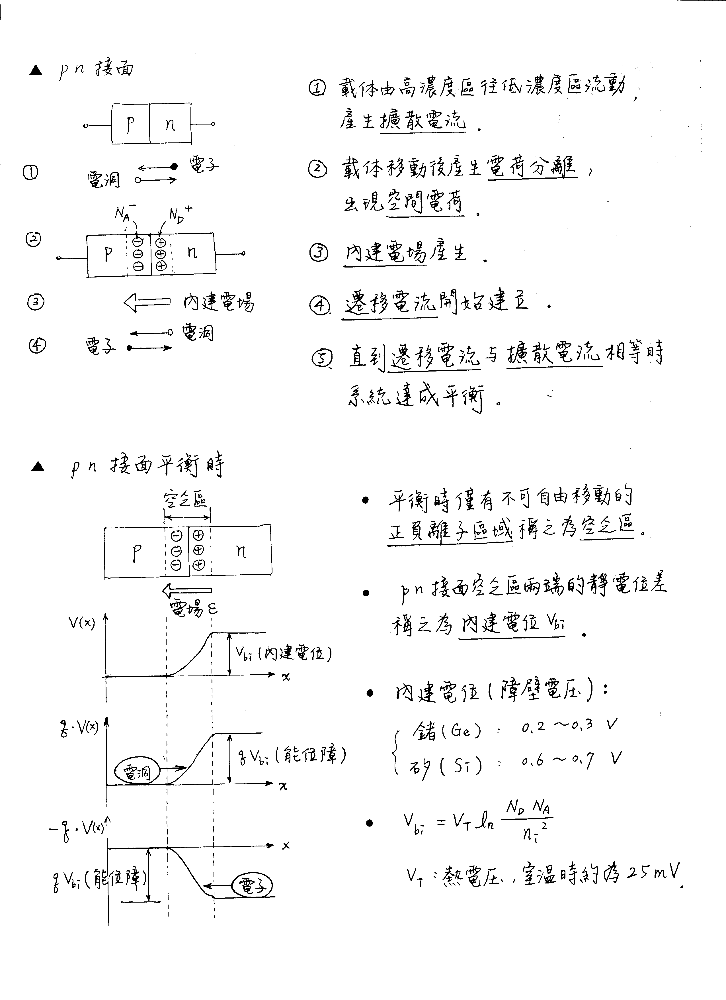
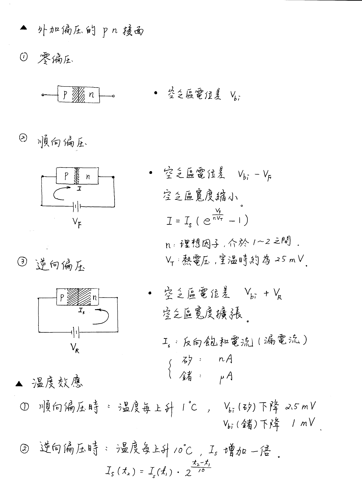
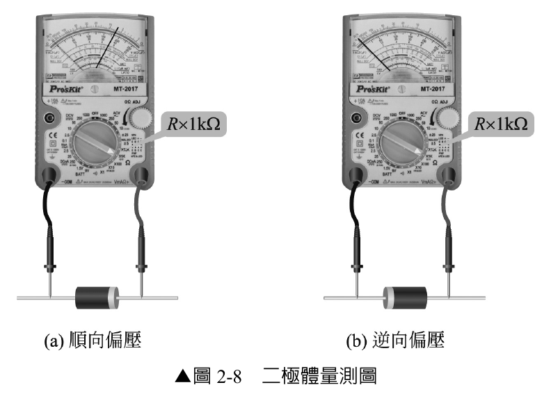

# 實習 2-1：二極體之識別

> 適用課程：電子學實習（上冊）第 2 章「二極體及應用電路」  
> 使用儀器：指針式（類比）三用電表  
> 實習元件：1N4001（矽二極體）、1N60（鍺二極體）

---

## 一、實習目的

1. 認識半導體與 PN 接面二極體的基本構造及端點名稱。
2. 學會使用指針式三用電表判斷二極體為良好、短路或開路。
3. 學會根據順向壓降，判別二極體為矽（Si）或鍺（Ge）材質。

---

## 二、實習重點（先備知識）

### 2.1 半導體基礎

- 常用半導體由四價元素矽（Si）或鍺（Ge）組成，稱為**本質半導體**。
- 摻入三價元素後形成 **P 型半導體**，主要載子為電洞。
- 摻入五價元素後形成 **N 型半導體**，主要載子為電子。
- P 型與 N 型半導體結合後形成 **PN 接面二極體（diode）**：
  - P 型端為**陽極（A，Anode）**。
  - N 型端為**陰極（K，Cathode）**。

### 2.2 PN 接面的形成

P 型與 N 型半導體接合後，接面附近的載子會依下列過程重新分布：

1. N 區的多數載子電子濃度較高，會由 N 區向 P 區擴散；P 區的多數載子電洞則由 P 區向 N 區擴散。
2. 電子與電洞越過接面後互相復合，使接面附近可自由移動的載子減少。
3. 載子離開後，N 區接面附近留下帶正電且不可移動的施體離子，P 區則留下帶負電且不可移動的受體離子。
4. 這些固定離子形成**空間電荷區**，並產生由 N 區指向 P 區的**內建電場**。
5. 內建電場使載子產生與擴散方向相反的漂移運動。達到熱平衡時，漂移電流與擴散電流大小相等、方向相反，因此外部觀察到的淨電流為零。

*圖 2-1　PN 接面的形成、空乏區、內建電場與熱平衡。*

### 2.3 空乏區與內建電位

- PN 接面附近缺少可自由移動的多數載子，因此稱為**空乏區（depletion region）**，也稱空間電荷區。
- 空乏區內的固定正、負離子形成內建電場及電位障壁，阻礙多數載子繼續越過接面。
- 空乏區兩端的平衡電位差稱為**內建電位**或**障壁電位**，以 Vbi 表示。
- 內建電位與摻雜濃度、材料及溫度有關，可表示為：

  Vbi = VT ln(NA ND / ni2)

  其中 NA、ND 分別為受體與施體濃度，ni 為本質載子濃度，VT 為熱電壓；室溫約 300 K 時，VT ≈ 25.9 mV。

> **觀念釐清：**內建電位存在於元件內部，無法直接用一般電表跨接二極體兩端量得。實驗中量到的是特定電流下的**順向壓降**，兩者概念相關，但不能視為完全相同的固定電壓。

### 2.4 外加偏壓對 PN 接面的影響

*圖 2-2　外加偏壓對電位障壁、空乏區寬度與電流的影響，以及溫度效應。*

| 偏壓狀態 | 接法與電位障壁 | 空乏區寬度 | 電流情形 |
|:---:|---|:---:|---|
| 零偏壓 | 未加外部電壓，接面維持內建電位 Vbi | 平衡寬度 | 漂移與擴散電流互相抵銷，淨電流約為零 |
| 順向偏壓 | P 端接正、N 端接負；有效障壁約降低為 Vbi − VF | 變窄 | 多數載子較容易越過接面，順向電流快速增加 |
| 逆向偏壓 | P 端接負、N 端接正；有效障壁約提高為 Vbi + VR | 變寬 | 多數載子受阻，僅有很小的反向漏電流 |

順向與逆向電流可用二極體方程式描述：

I = IS [exp(VD / (n VT)) − 1]

- IS：反向飽和電流。
- VD：二極體兩端電壓；順向為正、逆向為負。
- n：理想因子，通常約介於 1～2，視材料、製程與工作區域而定。
- VT：熱電壓，室溫時約為 25.9 mV。

在一般逆向偏壓且尚未進入崩潰區時，電流約為 −IS。矽二極體的反向漏電流通常可低至 nA 等級，鍺二極體則可能達 μA 等級，但實際值應以元件資料表與量測條件為準。

### 2.5 順向壓降與溫度效應

- 實際以電表量到的是特定測試電流下的**順向壓降**，不是固定不變的理想門檻：
  - 矽二極體的典型順向壓降約為 **0.6～0.7 V**。
  - 鍺二極體的典型順向壓降約為 **0.2～0.3 V**。
- 在順向電流固定的條件下，矽二極體的順向壓降通常隨溫度升高而下降，常用工程近似值約為 **−2 mV/°C**。
- 反向飽和電流 IS 會隨溫度上升而明顯增加。「溫度每升高 10°C，漏電流約增加一倍」可作為初步估算，但實際倍率會受材料、型號與工作溫度影響。
- 鍺二極體的反向漏電流通常比矽二極體大，因此溫度變化造成的影響也較明顯。
- 順向壓降同時受測試電流、溫度及元件型號影響；上述數值僅供本實驗辨識元件材質使用。

### 2.6 指針式三用電表的極性

- 本實驗依原教材指定，以指針式三用電表的電阻檔進行量測。
- 多數指針式三用電表在電阻檔時，**黑色測試棒為正（+）、紅色測試棒為負（−）**，因此：
  - 黑棒接陽極、紅棒接陰極時，二極體承受順向偏壓。
  - 黑棒接陰極、紅棒接陽極時，二極體承受逆向偏壓。

> **重要提醒：** 不同型號電表的內部接法可能不同。第一次使用前，應查閱電表說明書，或以一顆極性已知且良好的二極體確認電阻檔測試棒極性。

### 2.7 二極體量測接法

*圖 2-8　二極體順向與逆向量測接法。*

### 2.8 好壞判斷

| 順向偏壓 | 逆向偏壓 | 判斷結果 |
|:---:|:---:|:---:|
| 指針偏轉（導通） | 幾乎不偏轉（截止） | **良好** |
| 指針偏轉 | 指針偏轉 | **短路（損壞）** |
| 不偏轉 | 不偏轉 | **開路（損壞）** |

確認二極體良好後，再於順向偏壓下讀取 LV 刻度：

- 約 **0.6–0.7 V**：判定為矽二極體，例如 1N4001。
- 約 **0.2–0.3 V**：判定為鍺二極體，例如本實驗使用的 1N60。

---

## 三、實習步驟（工作一）

1. 準備 1N4001 與 1N60 二極體，先由外觀色環辨識陰極（K）。
2. 將指針式三用電表切至 **R × 1 kΩ** 檔。
3. 完成機械零點調整，再將兩測試棒短接，完成歐姆零點調整。
4. 依圖 2-8（a）連接順向偏壓：黑棒接陽極（A），紅棒接陰極（K），觀察指針是否偏轉。
5. 依圖 2-8（b）連接逆向偏壓：黑棒接陰極（K），紅棒接陽極（A），觀察指針是否偏轉。
6. 對照好壞判斷表，判定二極體為良好、短路或開路。
7. 確認元件良好後，再依順向接法讀取 LV 刻度，記錄順向壓降並判別材質。

### 量測紀錄

| 元件編號 | 順向指針反應 | 逆向指針反應 | LV 刻度電壓 | 材質 | 判斷結果 |
|:---:|:---:|:---:|:---:|:---:|:---:|
| 1N4001 |  |  |  |  |  |
| 1N60 |  |  |  |  |  |

---

## 四、注意事項

- 本實驗使用指針式三用電表，是為了配合原教材的電阻檔與 LV 刻度判讀方法；數位電表仍可使用二極體檔檢測，但操作與讀值方式不同。
- 換檔後必須重新進行歐姆零點調整。
- 請使用 **R × 1 kΩ** 檔：
  - 不使用 R × 1 檔，以免測試電流過大。
  - 不使用 R × 10 kΩ 檔，以免較高的內部測試電壓造成誤判或損傷低耐壓元件。
- 二極體本體的白色環或色環通常表示陰極（K），應先目視辨識，再以電表交叉確認。
- 若順、逆向都導通，表示元件短路損壞；這種狀態不應稱為「擊穿」。
- 若順、逆向都不導通，表示元件可能開路損壞，應更換後再繼續。

---

## 五、問題與討論

### 問題

如何使用指針式三用電表判斷二極體的好壞，並區分矽二極體與鍺二極體？

### 參考回答

1. 將電表切至 R × 1 kΩ 檔並完成調零。
2. 順向接法時二極體應導通，逆向接法時應截止，符合此結果者為良好元件。
3. 順、逆向都導通表示短路；順、逆向都不導通表示開路。
4. 良好元件在順向偏壓下，順向壓降約 0.6–0.7 V 者通常為矽二極體；約 0.2–0.3 V 者通常為鍺二極體。

---

## 附錄：實習知識填空參考答案（供教師批改）

1. 四價元素組成：**本質半導體**；摻入三價元素：**P 型半導體**；摻入五價元素：**N 型半導體**。
2. PN 接面元件：**二極體（diode）**；P 型端：**陽極（A）**；N 型端：**陰極（K）**。
3. 接面附近區域：**空乏區**；其內形成的電位差：**內建電位（障壁電壓）**。
4. 本實驗常用的材質判別近似值：矽約 **0.6–0.7 V**；鍺約 **0.2–0.3 V**。
