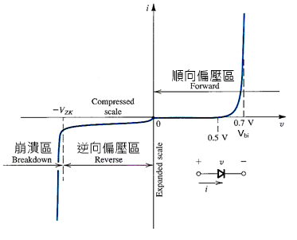
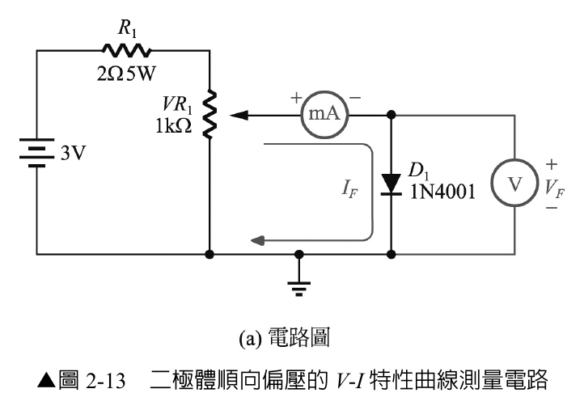
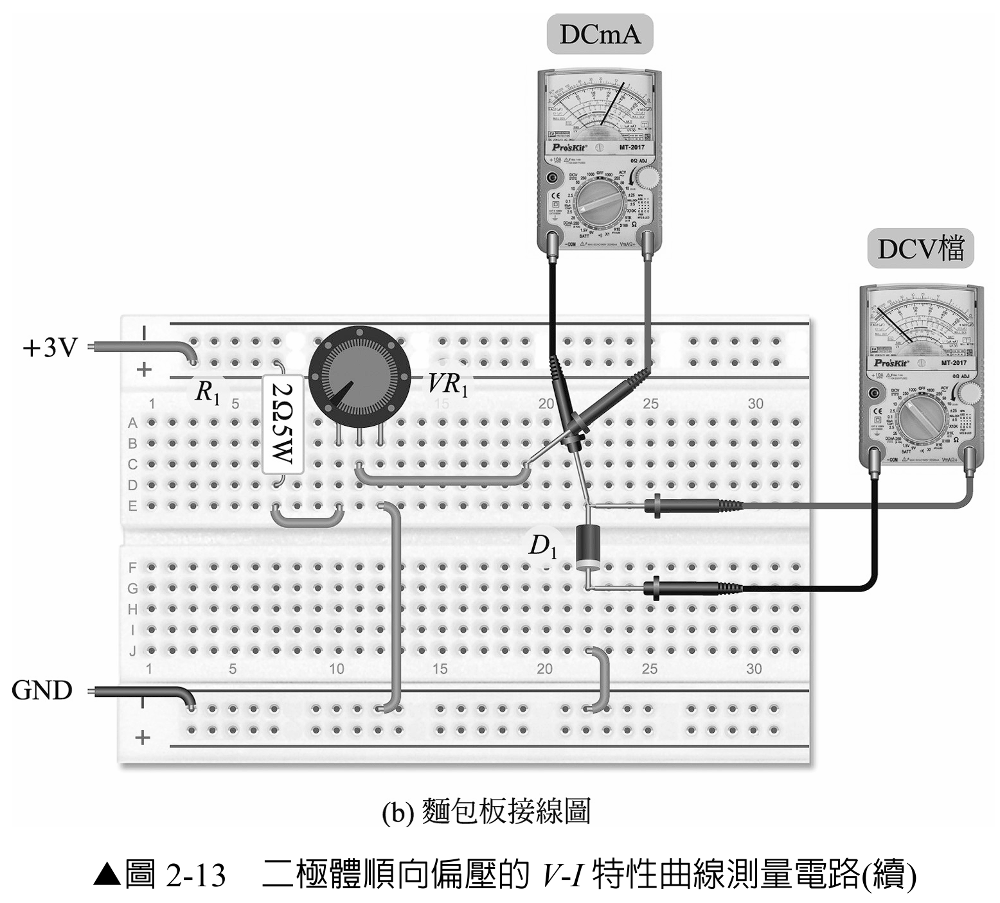
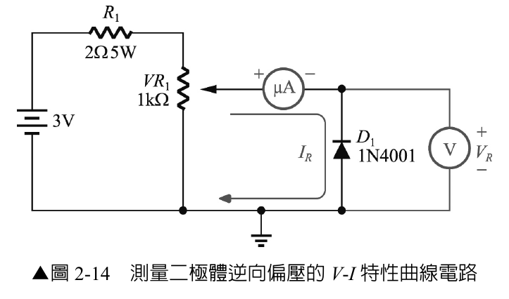
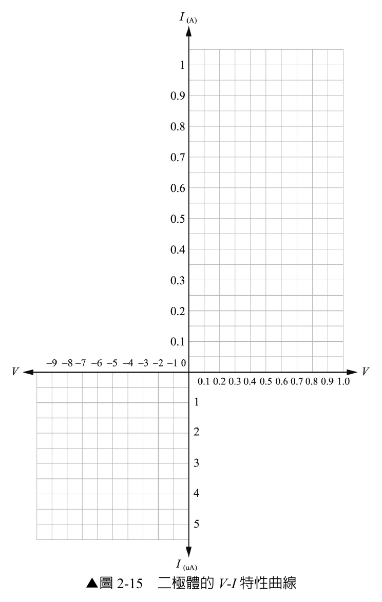

# 實習 2-2：二極體之 V-I 特性曲線

> 適用課程：電子學實習（上冊）第 2 章「二極體及應用電路」  
> 使用元件：1N4001（矽整流二極體）、R1（2 Ω／5 W）、VR1（1 kΩ）、麵包板與跳線  
> 使用儀器：直流電源供應器、直流電流表、直流電壓表；示波器為選用設備

---

## 一、實習目的

1. 理解二極體在順向偏壓與逆向偏壓下的導通及截止特性。
2. 實際量測二極體的順向 VF–IF 與逆向 VR–IR 特性。
3. 根據量測數據繪製完整的 V-I 特性曲線。
4. 練習正確設定電源電壓、電流上限、電表檔位及可變電阻。

---

## 二、器材與安全設定

### 2.1 實作限制

| 量測模式 | 電源設定 | 電源電流上限 | 電流表檔位 | 本實驗停止條件 |
|:---:|:---:|:---:|:---:|:---|
| 順向量測 | +3 V | **100 mA** | DC mA | IF 達 100 mA，或元件出現異常時立即停止 |
| 逆向量測 | 建議 +10 V，且**必須足以取得 7 V 以上的逆向電壓** | **10 mA** | DC μA | VR 達 7 V 後停止，不再繼續升壓 |

> **注意：** 原圖 2-14 標示 3 V，但表 2-7 要求量測至 7 V；3 V 電源無法完成表 2-7。進行逆向量測前，必須關閉輸出，將電源調整為至少可提供 7 V；建議設為 +10 V，再以 VR1 調整二極體兩端的 VR。完成接線與檔位確認後才能重新開啟輸出。

> **安全警告：** R1（2 Ω／5 W）不可視為唯一的安全保護。電源供應器必須設定電流上限；VR1 必須由高阻值端開始緩慢調整。不可讓 VR1、二極體或電流表長時間承受大電流或過大功率。

### 2.2 立即停止並關閉輸出的情況

- 順向電流 IF 達到 **100 mA**。
- 電源進入限流模式，或電流突然快速上升且無法穩定控制。
- 二極體、VR1、R1 或導線出現明顯升溫、異味或變色。
- 電表超出量程、指針撞底或讀值不穩定。
- 接線鬆脫、二極體接反或發現短路。

> **補充說明：** 原圖 2-15 的順向電流座標畫到 1 A，但本教材的學生實作上限為 **100 mA**，不要求量測至 1 A。所得數據仍可用於觀察膝點與順向電流快速上升的趨勢。

---

## 三、實習重點（先備知識）

### 3.1 二極體的偏壓特性

- **順向偏壓**：陽極（A）接高電位、陰極（K）接低電位。當 VF 增加至膝點附近後，二極體進入導通區，呈現低阻抗特性，但仍具有順向壓降與動態電阻，不能視為理想短路。
- **逆向偏壓**：陽極接低電位、陰極接高電位。在崩潰電壓以前，二極體近似開路，但仍有微小的逆向漏電流 IR。
- 矽二極體的典型順向壓降約為 0.6–0.7 V；此數值會隨電流、溫度及元件型號改變，不是固定不變的開關門檻。

### 3.2 二極體的種類與用途

- **整流二極體（rectifier diode）**：可將交流電壓轉換為脈動直流，例如 1N4001。
- **發光二極體（LED，light-emitting diode）**：工作於順向偏壓，電子與電洞復合時會以光與熱的形式釋放能量。

### 3.3 V-I 特性曲線

*圖 2-15A　二極體完整 V-I 特性參考曲線。順向區與逆向崩潰區採不同的壓縮／放大比例，以便同時呈現電流差異；曲線為觀念示意，並非等比例座標。*

- 橫軸為二極體兩端電壓：順向為 +VF，逆向為 −VR。
- 縱軸為二極體電流：順向為 +IF，逆向為 −IR。
- 順向區位於第一象限；超過膝點後，電流會隨電壓快速上升。
- 逆向區位於第三象限；在崩潰以前，漏電流通常為 μA 等級。
- 當逆向電壓達到崩潰電壓附近時，逆向電流會急遽增加；本實習僅量測至 VR = 7 V，不進入 1N4001 的崩潰區。

---

## 四、實習步驟（工作一）

### A. 順向 V-I 特性量測（圖 2-13）

1. 依實習 2-1 的步驟，確認 1N4001 材質、極性及功能均正常。
2. 關閉電源輸出，將電源設為 **+3 V**，電流上限設為 **100 mA**。
3. 接線前，將 VR1 調至「電源正端到滑動端」的等效電阻最大位置。
4. 依圖 2-13 連接：
   - 電源經 R1 與 VR1 形成可調偏壓。
   - 電流表切至 DC mA 檔並串聯於二極體支路。
   - 電壓表切至 DC V 檔並聯於二極體兩端。
   - 二極體陽極接電流表負端，陰極接地。
5. 由同學互相交叉檢查電源極性、電表插孔、檔位及二極體方向。
6. 開啟電源輸出，緩慢調整 VR1，依序取得表 2-6 指定的 VF。
7. 每到一個量測點，待讀值穩定後立即記錄 IF，再進行下一點。
8. 若 IF 達 100 mA 或發生任何停止條件，立即停止調整並關閉輸出。

**表 2-6　二極體順向電壓與電流量測值**

| VF | 0 V | 0.1 V | 0.2 V | 0.3 V | 0.4 V | 0.5 V | 0.6 V | 0.7 V |
|:---:|:---:|:---:|:---:|:---:|:---:|:---:|:---:|:---:|
| IF |  |  |  |  |  |  |  |  |

### B. 逆向 V-I 特性量測（圖 2-14）

**逆向偏壓實作時，電源設定須依下列說明第4點調整。**

1. **先關閉電源輸出**，再將二極體反向：陰極接電流表負端，陽極接地。
2. 將電流表切換至 **DC μA** 檔，確認測試線插孔也已正確更換。
3. 將 VR1 調回「電源正端到滑動端」的等效電阻最大位置。
4. 為完成表 2-7，將電源調整為**足以取得 7 V 以上的逆向電壓**；建議設定為 **+10 V**，電流上限設定為 **10 mA**。
5. 再次檢查接線、二極體方向、電流表檔位與電源設定，確認無誤後開啟輸出。
6. 緩慢調整 VR1，依序取得 1–7 V 的 VR，記錄相對應的 IR。
7. 量到 7 V 後立即關閉輸出，不再繼續升壓。

**表 2-7　二極體逆向電壓與電流量測值**

| VR | 1 V | 2 V | 3 V | 4 V | 5 V | 6 V | 7 V |
|:---:|:---:|:---:|:---:|:---:|:---:|:---:|:---:|
| IR |  |  |  |  |  |  |  |

### C. 繪製特性曲線與結論（圖 2-15）

**繪製二極體 V-I 特性曲線圖時，縱座標的電流值請自行評估適合的範圍。**

1. 根據表 2-6 與表 2-7 的數據，在圖 2-15 上標出量測點。
2. 以平滑曲線連接各點，分別呈現順向導通區與逆向截止區。
3. 標示順向曲線開始快速上升的位置，並記錄實測膝點電壓。
4. 比較逆向漏電流是否維持在 μA 等級。

---

## 五、操作後檢核

- [ ] 電源輸出已關閉。
- [ ] 順向量測未超過 100 mA。
- [ ] 逆向量測已完成 1–7 V，且未超過設定範圍。
- [ ] 表 2-6、表 2-7 與圖 2-15 均已完成。
- [ ] 元件沒有異常發熱、異味或外觀損傷。
- [ ] 電表檔位與測試線已恢復至安全位置。

---

## 六、問題與討論

### 問題

請說明二極體在順向偏壓與逆向偏壓下的特性。

### 參考回答

- **順向偏壓**：當陽極電位高於陰極電位時，二極體承受順向偏壓。低電壓時電流很小；當 VF 接近膝點後，IF 會快速增加。導通的二極體可近似為低阻抗元件，但仍有順向壓降與動態電阻。
- **逆向偏壓**：當陰極電位高於陽極電位時，二極體承受逆向偏壓。在崩潰電壓以前，二極體近似開路，但仍有微小的逆向漏電流 IR。

---

## 附錄：實習知識填空參考答案（供教師批改）

1. 二極體施加**順向**偏壓並進入導通區後，呈現低阻抗特性且順向電流快速增加。
2. 二極體施加**逆向**偏壓且未達崩潰電壓時，近似開路並只有微小漏電流。
3. **整流**二極體可將交流電壓轉換為脈動直流。
4. **發光**二極體（LED）在順向偏壓下，會將部分能量轉換為光與熱。
5. 矽二極體的順向膝點通常約在 **0.6–0.7 V**，實際數值會受電流與溫度影響。
