# 實習 2-3　整流電路

> 原始教材：[實習2-3.pdf](實習2-3.pdf)　｜　建議課時：3 節

## 一、學習目標

完成本實習後，學生應能：

1. 說明半波、中心抽頭式全波及橋式全波整流電路的工作原理。
2. 正確判斷二極體於正、負半週的導通狀態及負載電流方向。
3. 使用示波器觀察輸入與輸出波形，量測峰值、週期與頻率。
4. 由變壓器次級有效值計算理想峰值、直流平均值及有效值，並比較理論值與實測值。
5. 比較三種整流方式的導通二極體數、輸出頻率及二極體壓降影響。

## 二、器材與元件

| 類別 | 品名與規格 | 數量 |
|---|---|---:|
| 電源 | 隔離式 110 V／6-0-6 V 變壓器 | 1 |
| 元件 | 1N4001 整流二極體 | 4 |
| 元件 | 1 kΩ 負載電阻 RL | 1 |
| 儀器 | 雙軌示波器與探棒 | 1 組 |
| 儀器 | 數位萬用電表 | 1 |
| 其他 | 麵包板與接線 | 1 組 |

## 三、工作原理

### 3-1　交流電壓的表示

若變壓器次級為正弦波，其峰值與有效值關係為：

> Vm = √2 × Vi(rms)

其中 Vi(rms) 是萬用電表 ACV 檔所量到的有效值，Vm 是示波器波形由 0 V 至正峰值的電壓。兩者不可直接當成相同數值。

### 3-2　半波整流

輸入正半週時，二極體順向偏壓而導通，負載取得正半週電壓；輸入負半週時，二極體截止，輸出接近 0 V。因此每一個輸入週期只有一個半週送至負載。

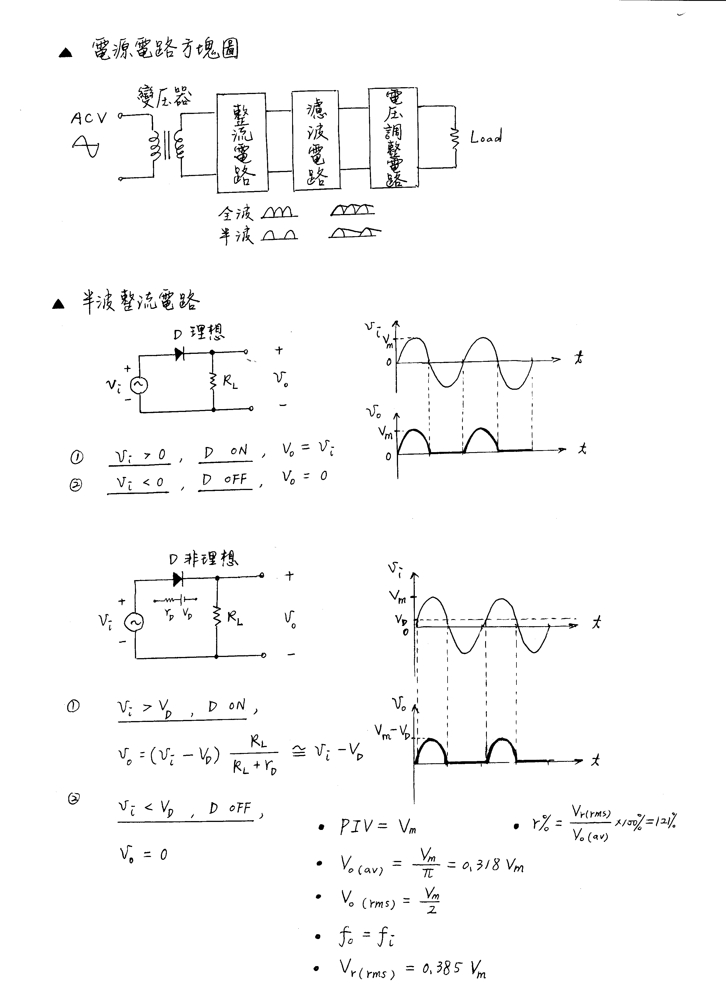

*半波整流電路分析：包含電源方塊圖、理想與非理想二極體模型，以及輸入、輸出波形。*

**導通過程與分段近似：**

1. 當 vi > VD 時，二極體承受順向偏壓而導通，負載電流由電源經二極體、RL 返回電源。若忽略二極體動態電阻，輸出可近似為 vo ≈ vi − VD。
2. 當 vi ≤ VD（包含負半週）時，二極體截止，負載中幾乎沒有電流，因此 vo ≈ 0。
3. 理想二極體令 VD = 0，因此輸出正半週峰值等於 Vm；實際矽二極體會使峰值降低約一個順向壓降。

半波整流器截止時，二極體所承受的最大反向電壓稱為**峰值逆向電壓**（PIV），理想近似為 PIV = Vm。選用二極體時，其額定反向耐壓必須高於此值並保留安全裕量。

理想二極體近似下：

- 直流平均值：Vdc = Vm／π ≈ 0.318 Vm
- 輸出有效值：Vo(rms) = Vm／2 = 0.5 Vm
- 輸出頻率：fo = fi
- 未濾波輸出的漣波因數約為 1.21（121%）。漣波因數越大，表示輸出中的交流成分相對越多。

實際電路的正峰值約為 Vm − VD，矽二極體 1N4001 的 VD 通常約 0.6–0.8 V，因此實測值會低於理論值。

### 3-3　中心抽頭式全波整流

上半組次級為正時 D1 導通；下半組次級為正時 D2 導通。兩個半週流過 RL 的方向相同，所以負載每個輸入週期得到兩個正脈波。

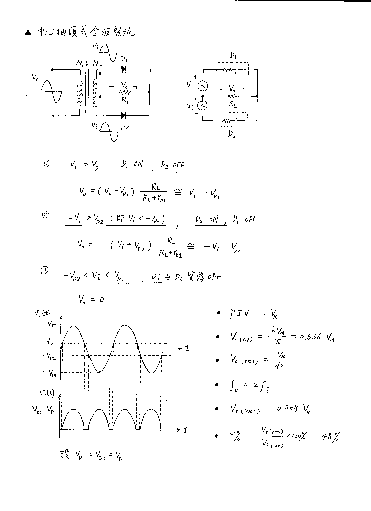

*中心抽頭式全波整流電路分析：兩組次級電壓相位相反，D1、D2 輪流導通，但通過負載的電流方向相同。*

**導通過程與分段近似：**

1. 上端相對中心抽頭為正且電壓超過 VD1 時，D1 導通、D2 截止；電流由上半組次級經 D1、RL 流回中心抽頭。
2. 下端相對中心抽頭為正且電壓超過 VD2 時，D2 導通、D1 截止；電流由下半組次級經 D2、RL 流回中心抽頭。
3. 每半週只有一顆二極體導通，因此在忽略動態電阻時，輸出可近似為 vo ≈ |vi| − VD；接近過零點、|vi| ≤ VD 時，兩顆二極體均截止，vo ≈ 0。
4. 兩個半週都在 RL 上產生相同極性的電壓，所以輸出週期為輸入的一半，輸出頻率為輸入的兩倍。

理想二極體近似下：

- Vm = √2 × V1(rms)，其中 V1 是中心抽頭至任一端的電壓。
- 直流平均值：Vdc = 2Vm／π ≈ 0.636 Vm
- 輸出有效值：Vo(rms) = Vm／√2 ≈ 0.707 Vm
- 輸出頻率：fo = 2fi
- 未濾波輸出的漣波因數約為 0.482（48.2%）。

每個半週只有一顆二極體串在負載電流路徑中，實際峰值約為 Vm − VD。

當其中一顆二極體導通至輸出正峰值時，另一顆截止二極體同時受到另一半次級的反向電壓，因此每顆二極體所需承受的 PIV 理想近似為 2Vm。這是中心抽頭式全波整流選擇二極體耐壓時的重要條件。

### 3-4　橋式全波整流

正、負半週各由橋式電路中不同的兩顆二極體導通，使負載電流方向保持一致。橋式整流不需要中心抽頭，但每次有兩顆二極體串聯導通。

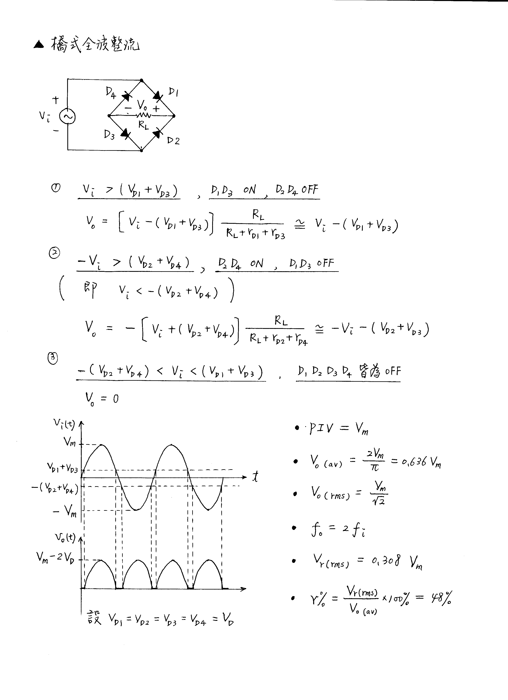

*橋式全波整流電路分析：正、負半週各由一對二極體導通，使 RL 兩端保持固定輸出極性。二極體編號與導通組合以本圖為準。*

**導通過程與分段近似：**

1. 正半週時，D1、D3 導通，D2、D4 截止；電流依序流經 D1、RL、D3 返回電源。
2. 負半週時，D2、D4 導通，D1、D3 截止；雖然輸入極性反轉，電流通過 RL 的方向仍與正半週相同。
3. 每次有兩顆二極體串聯導通。若四顆二極體的順向壓降均近似為 VD，則 |vi| > 2VD 時，vo ≈ |vi| − 2VD；接近過零點時四顆二極體均截止，vo ≈ 0。
4. 正、負半週都被轉成相同極性的輸出，因此 fo = 2fi。

- 直流平均值與輸出有效值的理想公式和全波整流相同。
- 輸出頻率：fo = 2fi。
- 實際輸出峰值約為 Vm − 2VD。
- 未濾波輸出的漣波因數約為 0.482（48.2%）。
- 每顆二極體所承受的 PIV 理想近似為 Vm，低於中心抽頭式全波整流所需的 2Vm。

### 3-5　三種整流方式比較

| 項目 | 半波 | 中心抽頭式全波 | 橋式全波 |
|---|---:|---:|---:|
| 使用二極體數 | 1 | 2 | 4 |
| 每半週導通數 | 1 | 1 | 2 |
| 是否需要中心抽頭 | 否 | 是 | 否 |
| 輸出脈波頻率 | fi | 2fi | 2fi |
| 理想 Vdc | 0.318Vm | 0.636Vm | 0.636Vm |
| 主要實際壓降 | 1 個 VD | 1 個 VD | 2 個 VD |

## 四、安全與接線規範

> **危險：** 圖中的 110 V 是市電一次側。一次側必須使用完整絕緣、具保護外殼的教學用隔離變壓器，學生只可在隔離後的 6 V 或 6-0-6 V 次級側接線與量測。示波器接地夾不可接到市電一次側。

> **注意：** 關閉電源後才可更改接線。通電前依序檢查二極體色環、負載電阻、變壓器端點及共同接地；示波器探棒接地夾只能接在電路指定的共同端。

> **注意：** 若使用一般桌上型接地示波器，兩個通道的接地端彼此相通且與保護地相連。不可把兩個接地夾接在不同電位，也不可用接地夾跨接橋式整流器的任意兩端。

## 五、實習一：半波整流電路

### 5-1　接線與原理確認

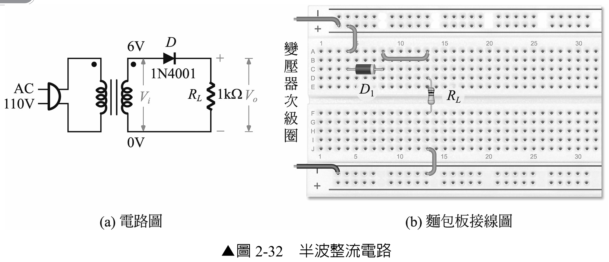

1. 關閉電源，依圖 2-32 接妥 1N4001 與 RL = 1 kΩ。
2. 以萬用電表二極體檔確認二極體方向；色環端為陰極，應朝輸出端。
3. 暫不接示波器，先量變壓器次級 Vi(rms)，再關閉電源。
4. 計算 Vm、Vdc 與 Vo(rms) 的理論值。

### 5-2　依元件數值進行實作前推估

以下以變壓器次級 Vi(rms) = 6 V、輸入頻率 fi = 60 Hz、矽二極體順向壓降 VD ≈ 0.7 V、RL = 1 kΩ 為例：

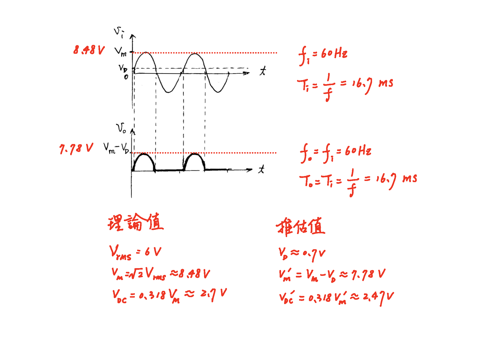

*工作一實作前推估：由 6 Vrms 輸入計算峰值、輸出峰值、平均值、頻率與週期。*

1. 輸入峰值：

   Vm = √2 × Vi(rms) = √2 × 6 V ≈ 8.48 V

2. 若採理想二極體模型，半波輸出的直流平均值為：

   Vdc(ideal) = Vm／π ≈ 0.318 × 8.48 V ≈ 2.70 V

3. 若以固定順向壓降 VD ≈ 0.7 V 作簡化估算，輸出峰值為：

   V′m ≈ Vm − VD ≈ 8.48 V − 0.7 V = 7.78 V

4. 再以輸出峰值估算直流平均值：

   V′dc ≈ V′m／π ≈ 0.318 × 7.78 V ≈ 2.47 V

5. 半波整流每個輸入週期只產生一個輸出脈波，因此：

   fo = fi = 60 Hz，To = Ti = 1／60 Hz ≈ 16.7 ms

> **說明：**V′dc = V′m／π 是便於實作前預估的簡化算法。實際二極體僅在輸入高於導通電壓時導通，順向壓降也會隨電流及溫度改變，因此精確平均值與此估算會有差異。

### 5-3　示波器量測

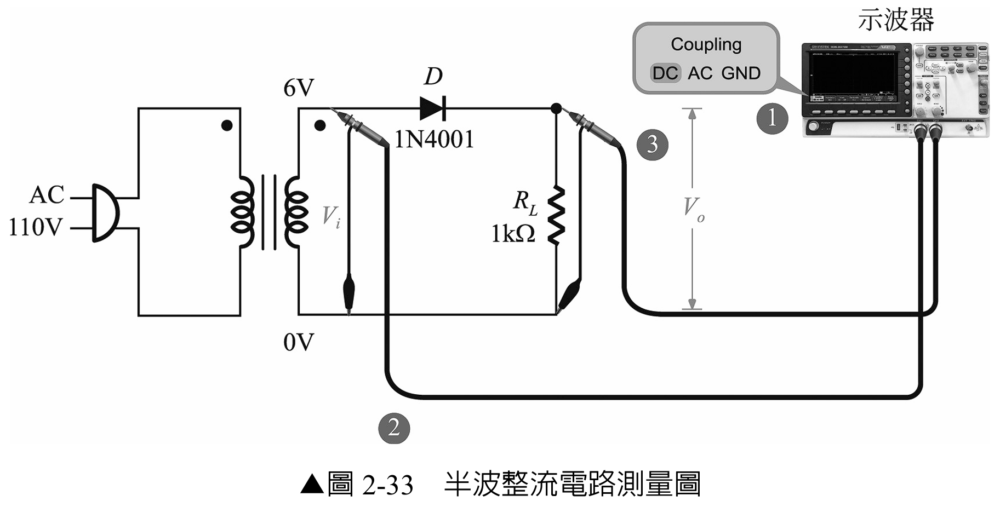

1. CH1 接變壓器次級 Vi，CH2 接負載輸出 Vo，兩通道接地夾接 0 V 共同端。
2. 兩通道先設為 DC 耦合，探棒倍率與示波器設定必須一致。
3. 先使用較大的 VOLTS/DIV，確認無超量程後再放大波形；調整 TIME/DIV 顯示 2–3 個週期。
4. 記錄波形、峰值、週期與頻率。確認 Vo 只有正半週，且 fo 約等於 fi。
5. 用萬用電表 DCV 檔跨接 RL，量測 Vdc。

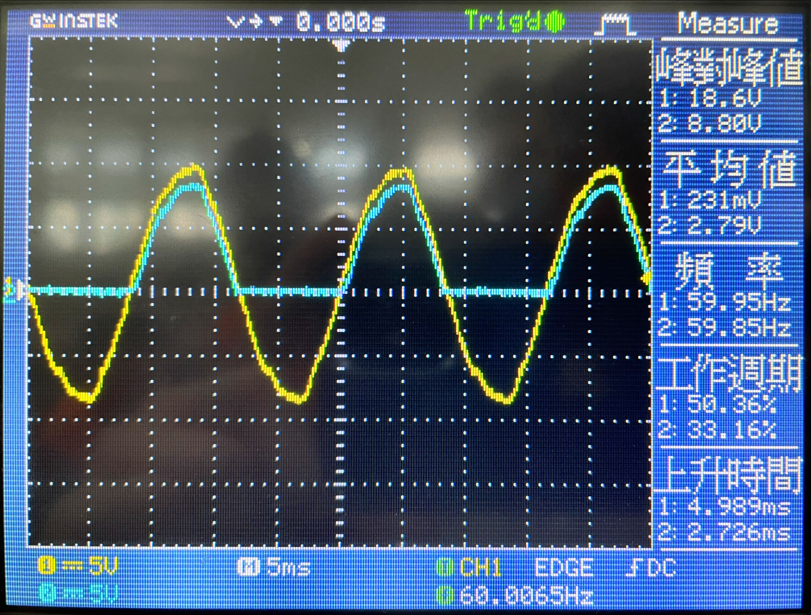

*工作一示波器實作結果：黃色 CH1 為變壓器次級輸入，藍色 CH2 為負載輸出。輸出僅保留正半週；理論上，其峰值會因二極體順向壓降而低於輸入正峰值。*

由圖中的自動量測值可作以下判讀：

- CH1 輸入峰對峰值約 18.6 V，因此輸入峰值約為 18.6／2 = 9.3 V。
- CH2 輸出峰對峰值約 8.80 V。由於半波輸出的最低值接近 0 V，其峰對峰值可近似視為輸出峰值。
- 二極體的障壁電壓約為 9.3 - 8.8 = 0.5 V。
- CH1、CH2 頻率分別約為 59.95 Hz 與 59.85 Hz，可視為相同，符合半波整流 fo = fi 的預期。
- CH2 畫面平均值約為 2.79 V，與理想值 2.70 V 及固定壓降簡化估值 2.47 V 為同一量級。

理論值與實測值不完全相同，可能來自變壓器空載／負載電壓差、二極體順向壓降不是固定 0.7 V、示波器探棒與量測演算法、波形零位偏移及元件誤差。實驗報告應以當次實際量到的 Vi(rms) 重新計算，不可只抄用本例數值。

| 波形 | VOLTS/DIV | 峰值或峰對峰值 | TIME/DIV | 週期 T | 頻率 f | 波形觀察 |
|---|---:|---:|---:|---:|---:|---|
| Vi |  |  |  |  |  | 正弦波 |
| Vo |  |  |  |  |  | 僅保留正半週 |

| 項目 | Vi(rms) | Vm | Vdc | Vo(rms) |
|---|---:|---:|---:|---:|
| 理論值 |  |  |  |  |
| 實測值 |  |  |  |  |
| 誤差百分比 | — |  |  |  |

## 六、實習二：中心抽頭式全波整流

### 6-1　接線與導通路徑

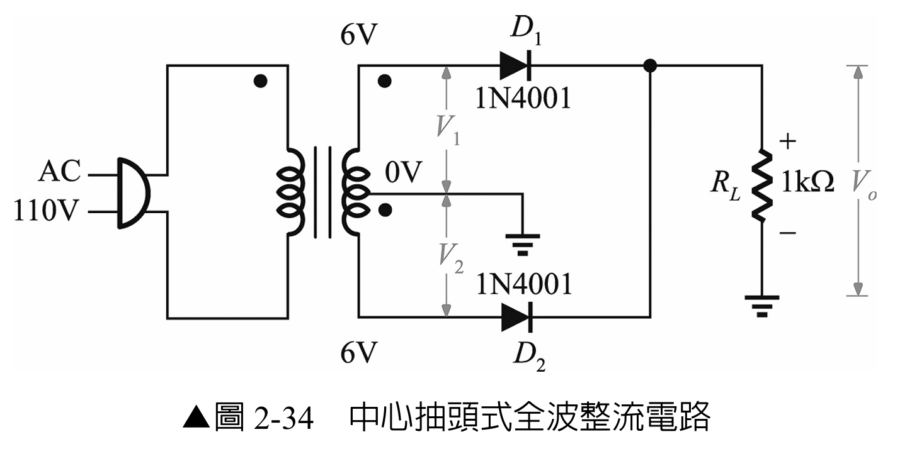

1. 關閉電源，確認 6-0-6 V 次級的中心抽頭為 0 V 共同端。
2. 依圖接妥 D1、D2 與 RL；兩顆二極體陰極在輸出端相接。
3. 分別量測中心抽頭至上端及下端的 AC 電壓，兩者應大致相等。
4. 上端為正半週時標示 D1 的電流路徑；下端為正半週時標示 D2 的電流路徑。兩條路徑通過負載的方向必須相同。

### 6-2　依元件數值進行實作前推估

以下以中心抽頭至任一端的次級電壓 V1(rms) = V2(rms) = 6 V、輸入頻率 fi = 60 Hz、矽二極體順向壓降 VD ≈ 0.7 V、RL = 1 kΩ 為例：

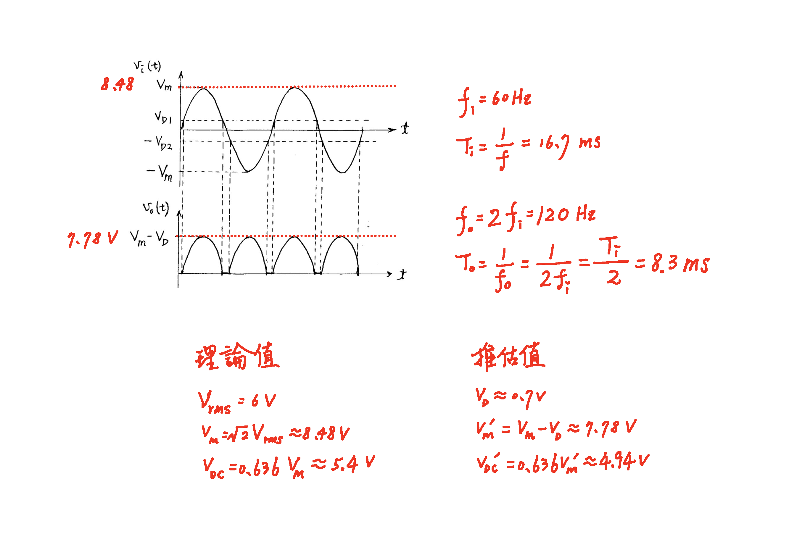

*工作二實作前推估：由單邊次級 6 Vrms 計算輸出峰值、平均值、頻率與週期。*

1. 單邊次級的輸入峰值為：

   Vm = √2 × V1(rms) = √2 × 6 V ≈ 8.48 V

2. 若採理想二極體模型，全波輸出的直流平均值為：

   Vdc(ideal) = 2Vm／π ≈ 0.636 × 8.48 V ≈ 5.40 V

3. 中心抽頭式全波整流每半週只有一顆二極體導通。若以固定順向壓降 VD ≈ 0.7 V 作簡化估算，輸出峰值為：

   V′m ≈ Vm − VD ≈ 8.48 V − 0.7 V = 7.78 V

4. 再以輸出峰值估算直流平均值：

   V′dc ≈ 2V′m／π ≈ 0.636 × 7.78 V ≈ 4.95 V

5. 正、負半週均形成正向輸出脈波，因此：

   fo = 2fi = 120 Hz，To = 1／fo ≈ 8.33 ms

> **說明：**以上固定壓降算法用於實作前快速推估。實際導通角、二極體順向壓降、變壓器內阻及負載效應都會影響平均值，因此實驗報告仍須使用當次量得的單邊次級 V1(rms) 或 V2(rms) 重新計算。

### 6-3　波形與數值量測

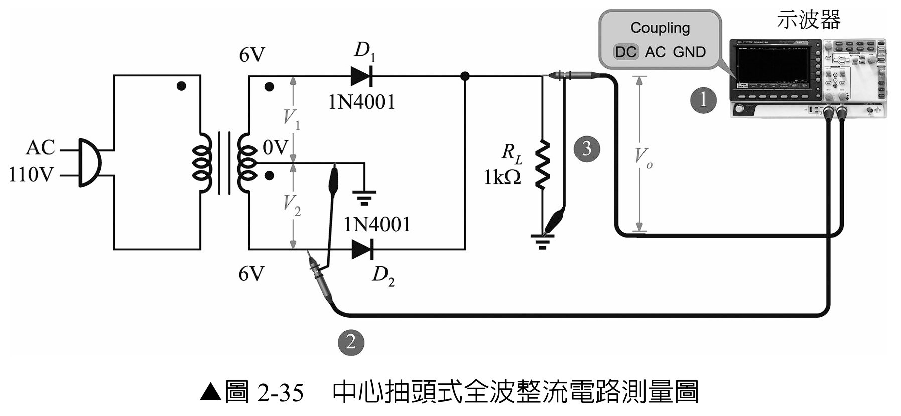

1. CH1 量測 V1（或 V2），CH2 量測 Vo；所有接地夾均接中心抽頭 0 V。
2. 使用 DC 耦合，記錄輸入與輸出波形。
3. 確認每個輸入週期有兩個輸出脈波，故輸出週期約為輸入的一半、頻率約為兩倍。
4. 量測 Vdc，並和以單邊次級 V1(rms) 計算的理論值比較。

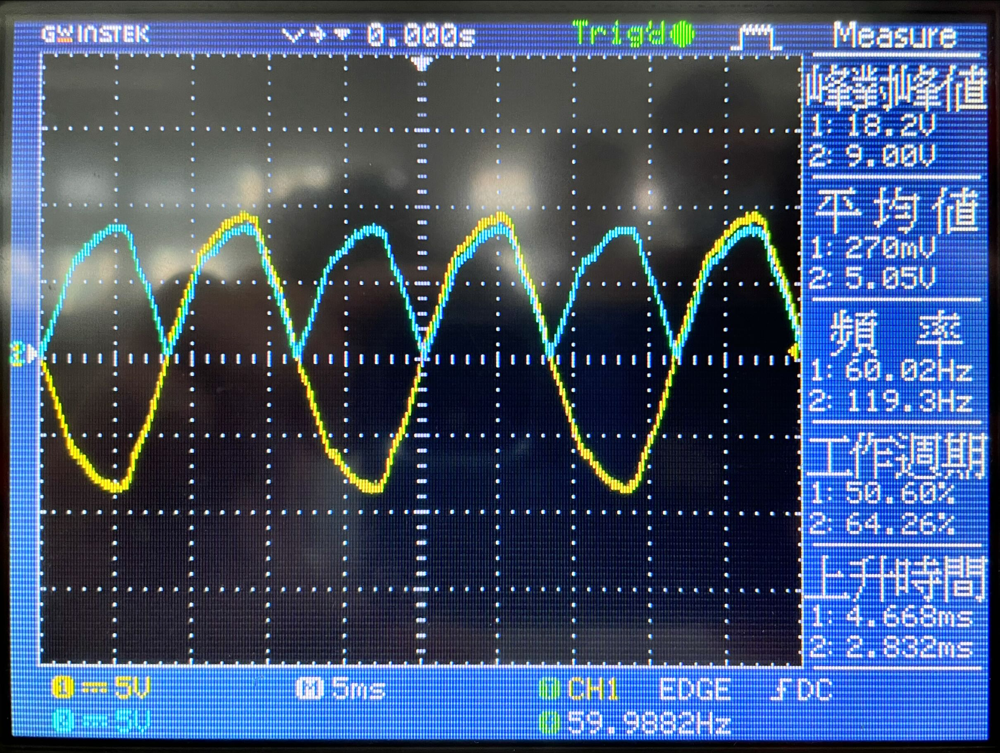

*工作二示波器實作結果：黃色 CH1 為中心抽頭至單邊次級的輸入波形，藍色 CH2 為負載的全波整流輸出。*

由圖中的自動量測值可作以下判讀：

- CH1 輸入峰對峰值約 18.2 V，因此單邊次級輸入峰值約為 18.2／2 = 9.1 V。
- CH2 輸出峰對峰值約 9.00 V，峰對峰值近似於輸出峰值。
- CH1 頻率約為 60.02 Hz，CH2 頻率約為 119.3 Hz，約為輸入的兩倍，符合 fo = 2fi。
- CH2 畫面平均值約為 5.05 V，介於固定壓降簡化估值 4.95 V 與理想值 5.40 V 之間，與理論趨勢相符。

理論值與實測值的差異可能來自變壓器空載／負載電壓差、兩半繞組電壓不完全相等、兩顆二極體的順向壓降差異、示波器零位與量測演算法，以及元件誤差。比較 D1 與 D2 所形成的相鄰脈波時，若峰值差異明顯，應優先檢查兩半繞組電壓與二極體接線。

| 波形 | VOLTS/DIV | 峰值或峰對峰值 | TIME/DIV | 週期 T | 頻率 f | 波形觀察 |
|---|---:|---:|---:|---:|---:|---|
| V1 或 V2 |  |  |  |  |  | 正弦波 |
| Vo |  |  |  |  |  | 正、負半週皆轉為正向 |

| 項目 | V1(rms) | Vm | Vdc | Vo(rms) |
|---|---:|---:|---:|---:|
| 理論值 |  |  |  |  |
| 實測值 |  |  |  |  |
| 誤差百分比 | — |  |  |  |

## 七、實習三：橋式全波整流

### 7-1　接線與極性檢查

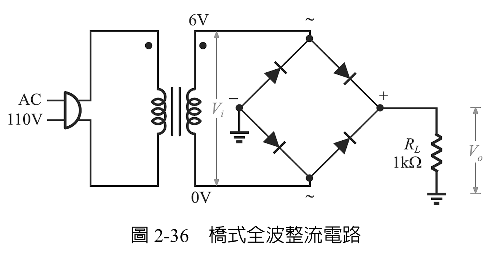

1. 關閉電源，先找出橋式整流器的兩個交流端 `~`、正輸出端 `+` 與負輸出端 `−`。
2. 變壓器次級接兩個 `~` 端，RL 接在 `+` 與 `−` 之間；不可依外觀猜測腳位。
3. 用二極體檔逐一路徑確認橋式整流器方向，再接通電源。

### 7-2　依元件數值進行實作前推估

以下以橋式整流器交流輸入端的 Vi(rms) = 6 V、輸入頻率 fi = 60 Hz、每顆矽二極體順向壓降 VD ≈ 0.7 V、RL = 1 kΩ 為例：

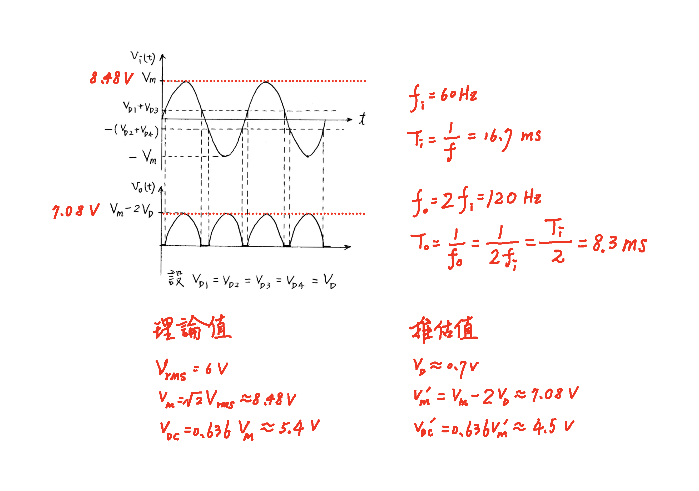

*工作三實作前推估：橋式整流每半週有兩顆二極體串聯導通，因此輸出峰值需扣除兩個順向壓降。*

1. 橋式輸入的峰值為：

   Vm = √2 × Vi(rms) = √2 × 6 V ≈ 8.48 V

2. 若採理想二極體模型，全波輸出的直流平均值為：

   Vdc(ideal) = 2Vm／π ≈ 0.636 × 8.48 V ≈ 5.40 V

3. 橋式整流每半週均有兩顆二極體導通。若各以 VD ≈ 0.7 V 作簡化估算，輸出峰值為：

   V′m ≈ Vm − 2VD ≈ 8.48 V − 1.4 V = 7.08 V

4. 再以輸出峰值估算直流平均值：

   V′dc ≈ 2V′m／π ≈ 0.636 × 7.08 V ≈ 4.50 V

5. 正、負半週均形成相同極性的輸出脈波，因此：

   fo = 2fi = 120 Hz，To = 1／fo ≈ 8.33 ms

> **說明：**固定扣除 2VD 是實作前的簡化估算。實際順向壓降會隨電流與溫度變化，而且接近輸入過零點時二極體不導通，因此精確平均值不會完全等於 0.636(Vm − 2VD)。

### 7-3　波形量測

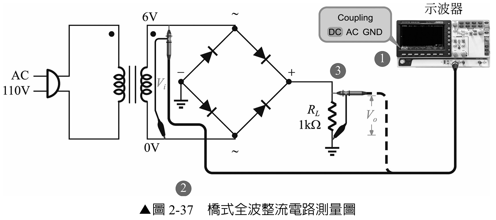

> **重要：** 依原教材採單通道依序量測。先量 Vi，關閉電源後移動探棒與接地夾，再量 Vo。一般接地示波器不可同時把接地夾接在橋式輸入與輸出不同節點，否則可能短路橋式整流器。

1. 使用 DC 耦合，先量測次級輸入 Vi 並記錄設定與波形。
2. 關閉電源，將示波器改接 RL 兩端，接地夾接橋式負輸出 `−`，再重新通電量測 Vo。
3. 記錄 Vdc，確認輸出頻率約為輸入的兩倍。
4. 比較橋式實測峰值與中心抽頭式實測峰值，說明兩顆串聯二極體壓降的影響。

**輸入波形實測：**

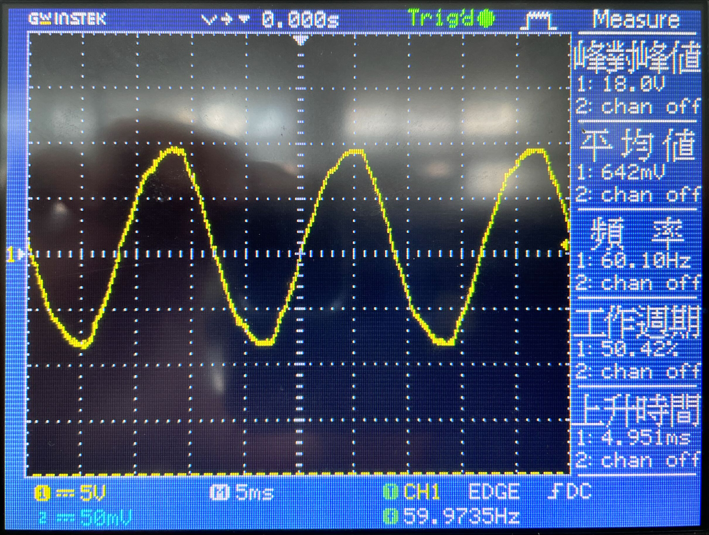

*橋式整流輸入 Vi 的單通道量測結果。畫面顯示峰對峰值約 18.0 V、頻率約 60.10 Hz。*

**輸出波形實測：**

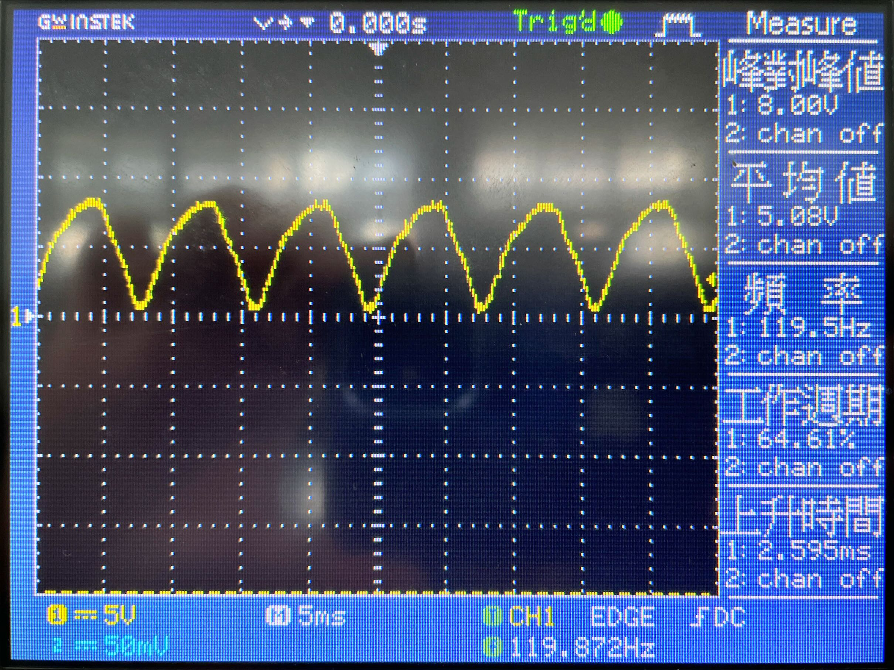

*橋式整流輸出 Vo 的單通道量測結果。負半週已翻轉為正向脈波，輸出頻率約為輸入的兩倍。*

由兩張示波器畫面的自動量測值可作以下判讀：

- 輸入 Vi 的峰對峰值約為 18.0 V，因此輸入峰值約為 18.0／2 = 9.0 V。此值高於以額定 6 Vrms 計算的 8.48 V，可能是變壓器在輕載時的次級電壓高於額定值。
- 輸入頻率約為 60.10 Hz，輸出頻率約為 119.5 Hz，符合 fo ≈ 2fi。
- 輸出峰對峰值約為 8.00 V。由於全波輸出的谷值接近 0 V，此讀值可近似反映輸出峰值；相較輸入峰值約少 1.0 V，呈現橋式導通路徑中兩顆二極體壓降的影響，但精確壓降仍應以游標量測同一次實驗的峰值確認。
- 輸出畫面平均值約為 5.08 V，介於以額定 6 Vrms 計算的固定壓降簡化估值 4.50 V 與理想值 5.40 V 之間。

輸入與輸出採單通道依序量測，兩張畫面的垂直零位及自動量測條件可能不同，因此不可直接用畫面高度相減求二極體壓降。實驗報告應記錄每次的探棒倍率、VOLTS/DIV、零位與實際 Vi(rms)，再比較理論值與實測值。

| 波形 | VOLTS/DIV | 峰值或峰對峰值 | TIME/DIV | 週期 T | 頻率 f | 波形觀察 |
|---|---:|---:|---:|---:|---:|---|
| Vi |  |  |  |  |  | 正弦波 |
| Vo |  |  |  |  |  | 全波脈動直流 |

| 項目 | Vi(rms) | Vm | Vdc | Vo(rms) |
|---|---:|---:|---:|---:|
| 理論值 |  |  |  |  |
| 實測值 |  |  |  |  |
| 誤差百分比 | — |  |  |  |

## 八、綜合比較與討論

| 整流方式 | Vdc 實測值 | Vo 峰值 | 輸出頻率 | 輸入／輸出頻率比 | 與理論不一致的可能原因 |
|---|---:|---:|---:|---:|---|
| 半波 |  |  |  |  |  |
| 中心抽頭式全波 |  |  |  |  |  |
| 橋式全波 |  |  |  |  |  |

1. 為什麼半波輸出頻率與輸入相同，而全波輸出頻率是輸入的兩倍？
2. 為什麼橋式整流的輸出峰值通常比使用相同單邊峰值的中心抽頭式整流低？
3. 實測 Vdc 低於理論值時，除了二極體壓降，還可能受到哪些因素影響？
4. 若橋式整流器其中一顆二極體開路，輸出波形可能變成什麼形狀？

## 九、完成檢核

- [ ] 三種電路均在斷電狀態下完成接線與極性檢查。
- [ ] 每次量測均記錄探棒倍率、耦合方式、VOLTS/DIV 與 TIME/DIV。
- [ ] 表格中的理論值、實測值與單位皆完整。
- [ ] 能由波形說明半波與全波整流的頻率差異。
- [ ] 能說明橋式電路為何產生兩個二極體壓降。
- [ ] 實習結束後關閉電源並拆除一次側以外的實驗接線。
