# 實習 2-4　濾波電路

> 原始教材：[實習2-4.pdf](實習2-4.pdf)　｜　建議課時：5～6 節

## 一、學習目標

完成本實習後，學生應能：

1. 說明電容輸入式濾波器的充電、放電與漣波形成原因。
2. 正確使用示波器的 DC 與 AC 耦合，分別觀察輸出直流準位與漣波。
3. 由漣波峰對峰值求漣波有效值與漣波百分率。
4. 比較電容量、負載電阻及整流方式對漣波的影響。
5. 說明增大濾波電容雖可降低漣波，卻會提高二極體充電峰值電流。

## 二、器材與元件

| 類別 | 品名與規格 | 數量 |
|---|---|---:|
| 電源 | 隔離式 110 V／6-0-6 V 變壓器 | 1 |
| 元件 | 1N4001 整流二極體 | 4（實習一只用 1 顆，其餘供實習二、三使用） |
| 元件 | 47 μF／25 V 電解電容 | 1 |
| 元件 | 470 μF／25 V 電解電容 | 1 |
| 元件 | 1 kΩ、10 kΩ 負載電阻 | 各 1 |
| 儀器 | 雙軌示波器與探棒 | 1 組 |
| 儀器 | 數位萬用電表 | 1 |
| 其他 | 麵包板與接線 | 1 組 |

## 三、工作原理

### 3-1　電容濾波作用

整流輸出上升且高於電容電壓時，二極體導通，電容快速充電至接近波峰；整流輸出下降後，二極體截止，電容經 RL 緩慢放電供應負載。輸出因此不再每半週回到 0 V，而是在直流準位上保留小幅週期性變化，稱為漣波電壓 Vr。

負載時間常數為：

> τ = RLC

τ 越大，兩個充電波峰之間的放電越慢，漣波通常越小。

### 3-2　半波整流濾波器（實習一）

半波整流器每個輸入週期只替電容充電一次，漣波頻率等於電源頻率 f。小漣波近似下：

> Vr(p-p) ≈ IL／(fC)
>
> r ≈ 1／(2√3 fRLC)

平均輸出可近似為：

> Vdc ≈ Vm − VD − Vr(p-p)／2

下圖由無負載與有負載兩種狀態說明半波峰值整流器。無負載時，電容充電至接近輸入峰值後維持電壓；接上 RL 後，二極體截止期間電容會經負載放電，直到下一個正半週接近波峰時再次充電，因此形成週期為 T 的漣波。圖中並整理鋸齒波近似、平均輸出與 RLC 對漣波的影響。

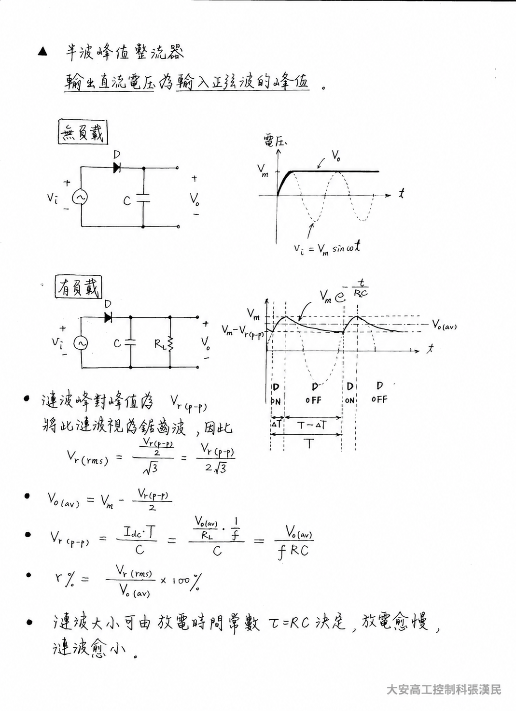

### 3-3　全波整流濾波器（實習二、三）
中心抽頭式與橋式全波整流每個輸入週期替電容充電兩次，漣波頻率為 2f，因此在相同 RL 與 C 下，漣波比半波整流小。

> Vr(p-p) ≈ IL／(2fC)
>
> r ≈ 1／(4√3 fRLC)

中心抽頭式每次經過一顆二極體，平均輸出可近似為
> Vdc ≈ Vm − VD − Vr(p-p)／2

橋式每次經過兩顆二極體。橋式電路的平均輸出可近似為：

> Vdc ≈ Vm − 2VD − Vr(p-p)／2

全波整流的電容每個輸入週期充電兩次，因此 fo = 2fi；在相同 RL 與 C 下，放電時間約為半波電路的一半，Vr(p-p) 也較小。下圖同時延伸介紹 RC 與 π 型濾波器：RC 濾波器以串聯電阻配合第二顆電容進一步衰減漣波，但會產生直流壓降；π 型濾波器以電感取代串聯電阻，可降低直流損失並阻礙交流漣波。

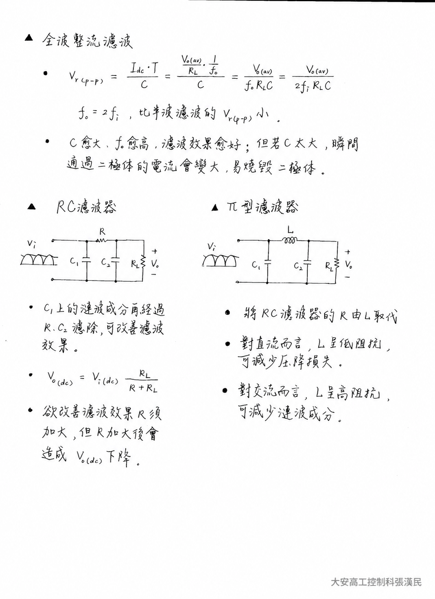

### 3-4　漣波的量測與計算

示波器使用 DC 耦合時可看到「直流準位加漣波」；切換為 AC 耦合後，直流成分被阻隔，可將小幅漣波放大觀察。萬用電表 DCV 檔用來量測 Vdc。

> **量測判讀：** Vdc 以萬用電表 DCV 檔或示波器 DC 耦合量測；Vr(p-p) 則以示波器 AC 耦合、縮小垂直刻度後的讀值為準。DC 與 AC 耦合畫面的自動峰對峰值可能因刻度、雜訊及判讀方式而不同，不宜直接互相比較。

若漣波近似三角波或鋸齒波：

> Vr(rms) ≈ Vr(p-p)／(2√3)

漣波因數與漣波百分率為：

> r = Vr(rms)／Vdc
>
> 漣波百分率 = r × 100%

下圖整理漣波的近似關係。Vdc 可用電表或示波器 DC 耦合量得；Vr(p-p) 宜用示波器 AC 耦合放大觀察，再換算 Vr(rms) 與漣波百分率。

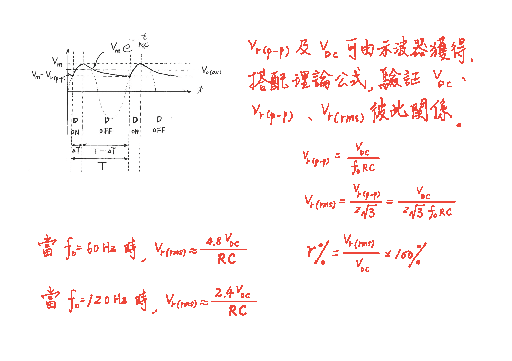

### 3-5　元件值的影響與取捨

| 改變項目 | 對漣波的影響 | 伴隨影響 |
|---|---|---|
| C 增大 | 漣波減小 | 充電時間縮短，二極體峰值電流與啟動突入電流增加 |
| RL 增大 | 負載電流減小，漣波減小 | 可供應的負載功率較小 |
| 半波改為全波 | 漣波頻率加倍、漣波減小 | 電路與二極體配置改變 |

實際電源亦可使用 RC 或 LC 多級濾波。RC 濾波成本低，但串聯電阻會造成壓降與功率損耗；LC 濾波以電感阻礙交流變化，適合較大電流，但體積與成本較高。

## 四、安全與量測規範

> **危險：** 圖中的 110 V 是市電一次側。學生只可操作隔離變壓器的低壓次級；示波器接地夾不可接到市電一次側。

> **警告：** 電解電容有極性。正端接整流輸出正端，負端接共同端；不得反接，也不得超過 25 V 額定電壓。電容反接可能發熱、漏液或爆裂。

> **警告：** 更換電容、負載或整流接線前，必須先關閉電源，並用電表確認電容電壓已降至安全值。不可用導線直接短路大型電容放電。

> **注意：** 所有示波器接地夾只能接電路指定共同端。探棒倍率必須與示波器設定一致。先用 DC 耦合確認總輸出不超量程，再切至 AC 耦合及較小 VOLTS/DIV 觀察漣波。

### 額定值與實測值的使用原則

以下實作前分析以變壓器額定 6 Vrms 作理論預估，因此 Vm = 6√2 ≈ 8.48 V。實際變壓器在輕載時，次級電壓可能高於額定值；本教材部分示波器截圖約為 18.0～18.6 Vp-p，相當於約 6.36～6.58 Vrms。額定值適合上電前預測，正式比較理論值與實測值時，應改用同次量得的 Vi(rms) 或 Vi(p-p) 重新計算。

## 五、實習一：半波整流濾波電路

### 5-1　47 μF 電容的輸出波形

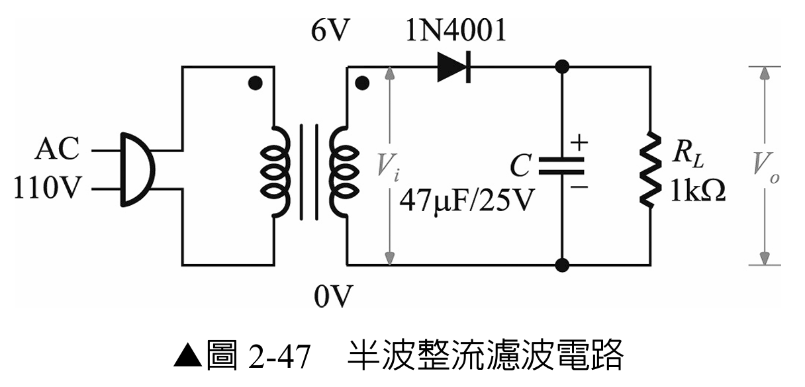

#### 實作前分析

本實習使用變壓器 6 Vrms 次級、半波整流二極體、RL = 1 kΩ 與濾波電容。輸入正弦波的峰值及扣除二極體順向壓降後的最高輸出約為：

> Vm = 6√2 ≈ 8.48 V
>
> V′m ≈ Vm − VD ≈ 8.48 − 0.7 = 7.78 V

未接濾波電容時，半波整流輸出的理想平均值約為 Vm／π；接上電容後，電容在輸入接近波峰且高於既有電容電壓時快速充電，二極體截止期間則透過 RL 放電，因此輸出成為直流準位上疊加鋸齒狀漣波。

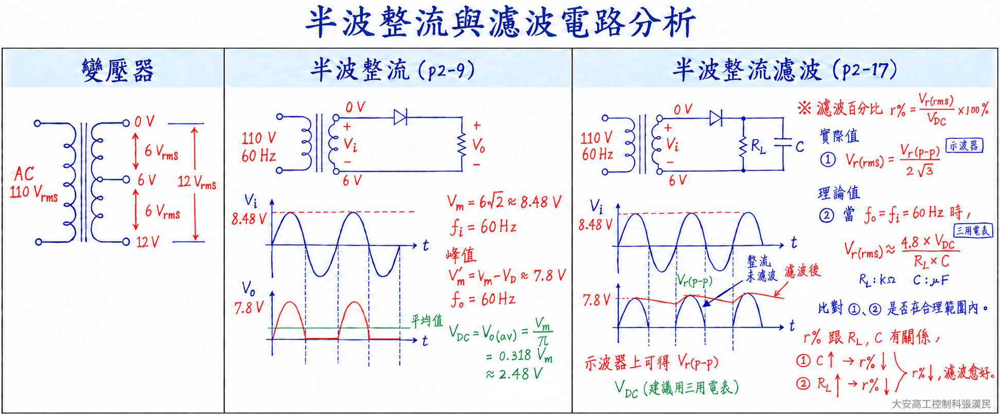

#### 接線與預測

1. 關閉電源，依圖 2-47 接妥 1N4001、C = 47 μF／25 V 與 RL = 1 kΩ。
2. 逐項檢查二極體方向與電容極性，確認無誤後才可通電。
3. 先預測：輸入正半週接近波峰時電容充電；其餘時間電容經 RL 放電。再作定量預估：若輸出平均約 7～8 V，則 IL ≈ 7～8 mA，Vr(p-p) ≈ IL／(fC) ≈ 2.5～2.8 V；待量測後再與實測值對照。

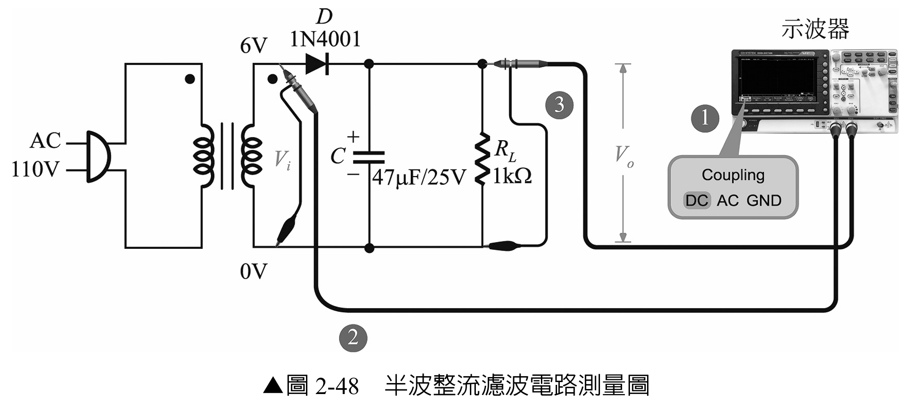

#### 上電量測

4. CH1 量測 Vi，CH2 量測 Vo，兩通道先設 DC 耦合並共接 0 V。
5. 記錄輸入與輸出波形，確認 Vo 保持正值並在波峰間緩慢下降。
6. 用萬用電表 DCV 檔量測 Vdc。
7. 保持探棒跨接輸出，將示波器切換為 AC 耦合；逐步調小 VOLTS/DIV，量測漣波 Vr(p-p)、週期與頻率。
8. 由 Vr(p-p)／(2√3) 計算 Vr(rms)，再計算漣波百分率；完成後將輸出通道切回 DC 耦合。

**學生實作紀錄表**

| 波形 | 耦合 | VOLTS/DIV | 峰值或峰對峰值 | TIME/DIV | 週期 T | 頻率 f | 波形觀察 |
|---|---|---:|---:|---:|---:|---:|---|
| Vi | DC |  |  |  |  |  | 正弦波 |
| Vo | DC |  |  |  |  |  | 直流準位上帶有漣波 |
| Vr | AC |  |  |  |  |  | 充電快、放電慢 |

### 5-2　比較 47 μF 與 470 μF

1. 關閉電源，並以電表確認 47 μF 電容電壓已降至 1 V 以下（大電容殘壓維持較久，不可用導線短路放電），再更換為 470 μF／25 V。
2. 保持變壓器與 RL = 1 kΩ 不變，重複 Vdc 與漣波量測。
3. 比較兩種電容量；除 C 以外的量測條件應保持一致。

**學生實作紀錄表**

| C | Vdc | Vr(p-p) | Vr(rms) = Vr(p-p)／(2√3) | 漣波百分率 | 充電尖峰觀察 |
|---:|---:|---:|---:|---:|---|
| 47 μF |  |  |  |  |  |
| 470 μF |  |  |  |  |  |

> **判讀重點：** 電容量增大時，Vdc 通常提高而漣波減小；但這不代表 C 可以無限制增大，因為二極體與變壓器必須承受更大的充電峰值電流。

### 5-3　實作結果與計算

以下為相同約 60 Hz 輸入及 RL = 1 kΩ 下的兩組量測結果。黃色為輸入波形，藍色為濾波後輸出；觀察小漣波時，輸出通道改用 AC 耦合並縮小垂直刻度。

#### （一）C = 47 μF

DC 耦合畫面顯示輸入約 18.6 Vp-p、輸出平均值約 7.52 V；輸出在每次充電波峰後緩慢下降，顯示電容正經負載放電。

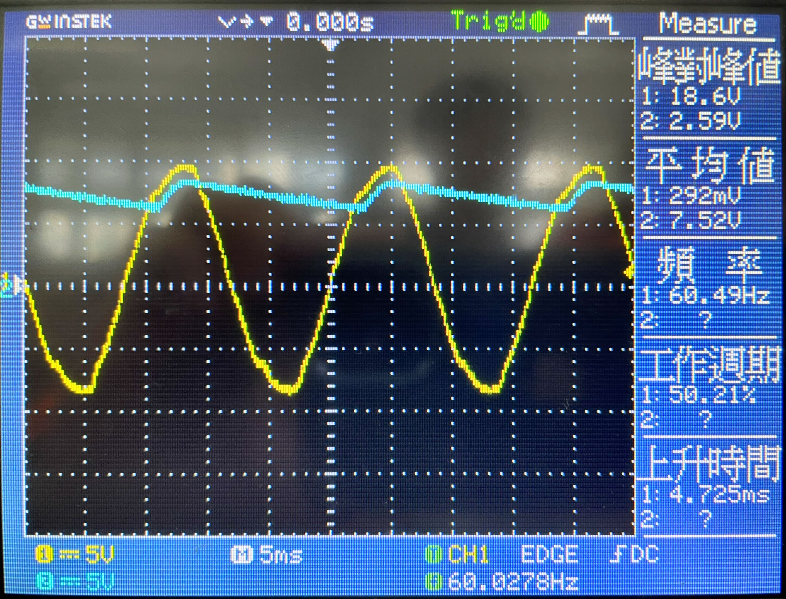

AC 耦合後量得漣波約 Vr(p-p) = 2.09 V，頻率約 59.81 Hz，接近半波整流的輸入頻率。

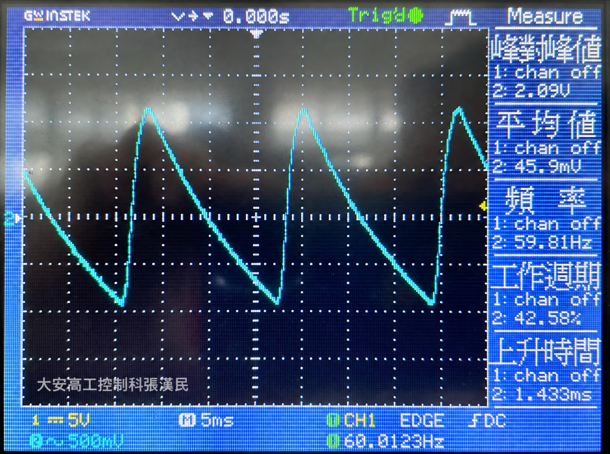

> Vr(rms) ≈ 2.09／(2√3) ≈ 0.603 V
>
> 漣波百分率 ≈ 0.603／7.52 × 100% ≈ 8.02%

#### （二）C = 470 μF

更換為 470 μF 後，DC 耦合畫面顯示輸出平均值提高至約 8.34 V，波峰間的電壓下降量明顯縮小。

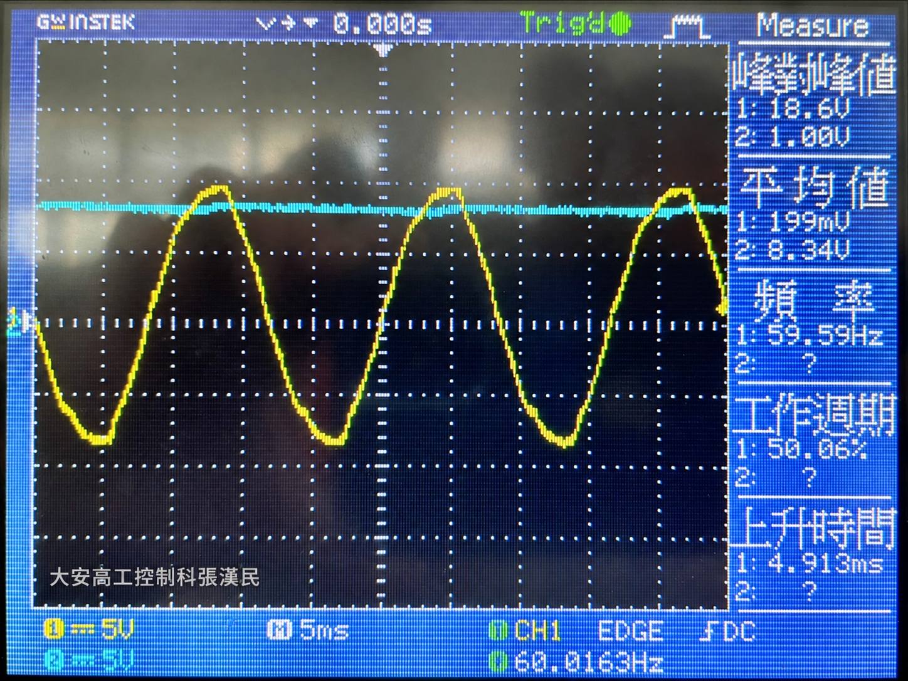

AC 耦合後量得漣波約 Vr(p-p) = 0.300 V，頻率約 60.42 Hz。

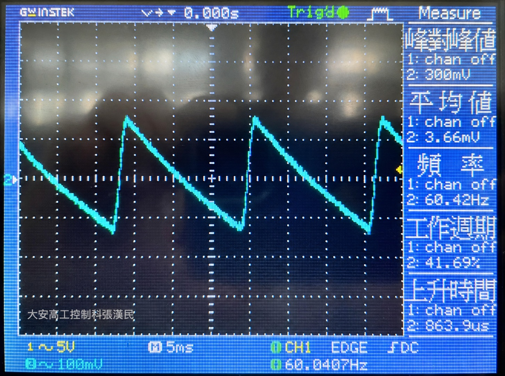

> Vr(rms) ≈ 0.300／(2√3) ≈ 0.0866 V
>
> 漣波百分率 ≈ 0.0866／8.34 × 100% ≈ 1.04%

**教師示範／參考結果**

| C | Vdc | Vr(p-p) | Vr(rms) | 漣波頻率 | 漣波百分率 |
|---:|---:|---:|---:|---:|---:|
| 47 μF | 7.52 V | 2.09 V | 0.603 V | 59.81 Hz | 8.02% |
| 470 μF | 8.34 V | 0.300 V | 0.0866 V | 60.42 Hz | 1.04% |

實測結果顯示，電容量由 47 μF 增加為 470 μF 後，Vr(p-p) 約降為原來的 14%，Vdc 則由 7.52 V 上升至 8.34 V。這是因為時間常數 RLC 增大，使電容在兩個充電波峰間的放電速度變慢。兩組漣波頻率皆約為 60 Hz，也符合半波整流每週期充電一次的工作原理。

## 六、實習二：中心抽頭式全波整流濾波電路

### 6-1　接線與波形

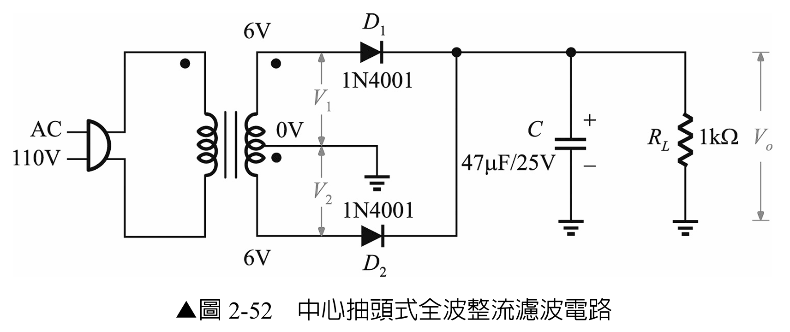

#### 實作前分析

中心抽頭至次級任一端為 6 Vrms，因此單一半繞組的峰值約為：

> Vm = 6√2 ≈ 8.48 V
>
> V′m ≈ Vm − VD ≈ 8.48 − 0.7 = 7.78 V

正、負半週分別由 D1、D2 導通，但負載電流方向相同，所以未濾波輸出為 120 Hz 的全波脈動直流。接上 47 μF 電容後，每半週波峰均會補充電荷，充電頻率 fo = 2fi ≈ 120 Hz；相較半波電路，電容放電時間縮短，因此相同負載及電容量下漣波較小。

其中 0.636 × 7.78 ≈ 4.94 V 是「未接電容時」的平均值對照，不可直接當成濾波後的平均輸出。接上電容後，以 IL ≈ 7～8 mA、C = 47 μF、2f = 120 Hz 估得 Vr(p-p) ≈ 1.2～1.4 V，再由濾波後平均值近似式得到 Vdc ≈ 7.1 V。輸出頻率為 120 Hz，週期約為 8.3 ms；數值均為上電前的量級預估，正式比較應代入實測輸入電壓。

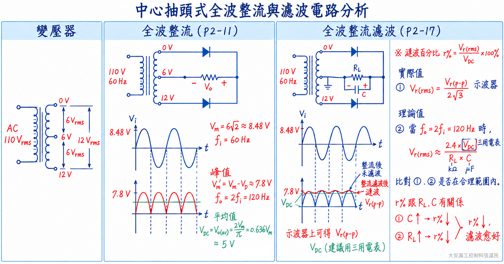

1. 關閉電源；若先前電路已通電，須以電表確認電容電壓已降至 1 V 以下。將中心抽頭接為 0 V，再共同確認 D1、D2 與 47 μF／25 V 電容的方向。
2. 先使用 RL = 1 kΩ。上、下半繞組輪流透過二極體替電容充電，因此充電間隔為半波電路的一半。

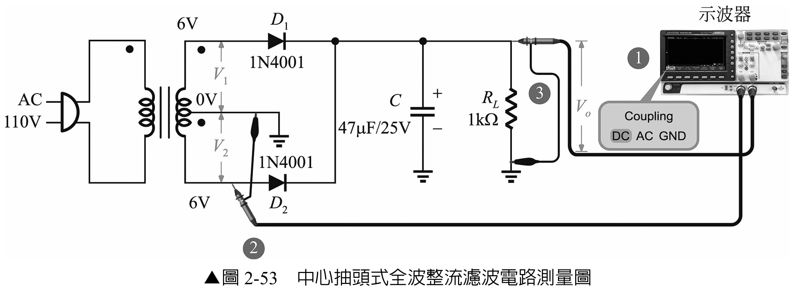

3. CH1 量中心抽頭至任一端的 V1 或 V2，CH2 量 Vo，接地夾均接中心抽頭 0 V。
4. 使用 DC 耦合觀察輸入與總輸出，量測 Vdc。
5. 將輸出通道切為 AC 耦合，量測 Vr(p-p)、漣波週期與頻率。
6. 確認漣波頻率約為輸入頻率的兩倍。

### 6-2　比較 1 kΩ 與 10 kΩ 負載

1. 完成 RL = 1 kΩ 的量測後關閉電源，並以電表確認電容電壓已降至 1 V 以下。
2. 更換 RL = 10 kΩ；保持 C = 47 μF、輸入電壓與量測方式不變。
3. 重新量測並比較。RL 增大會使放電電流減小，因此漣波應減小。

**學生實作紀錄表**

| RL | Vdc | Vr(p-p) | Vr(rms) | 漣波頻率 | 漣波百分率 |
|---:|---:|---:|---:|---:|---:|
| 1 kΩ |  |  |  |  |  |
| 10 kΩ |  |  |  |  |  |

> **教材更正：** 判斷負載效應時，正確結論是「RL 越大，負載電流越小，漣波百分率越小」。這一比較中電容量 C 保持不變。

### 6-3　實作結果與計算

#### （一）RL = 1 kΩ，C = 47 μF

DC 耦合畫面顯示輸出平均值約為 7.61 V。藍色輸出波形在相鄰充電波峰間下降，反映電容經 1 kΩ 負載放電。

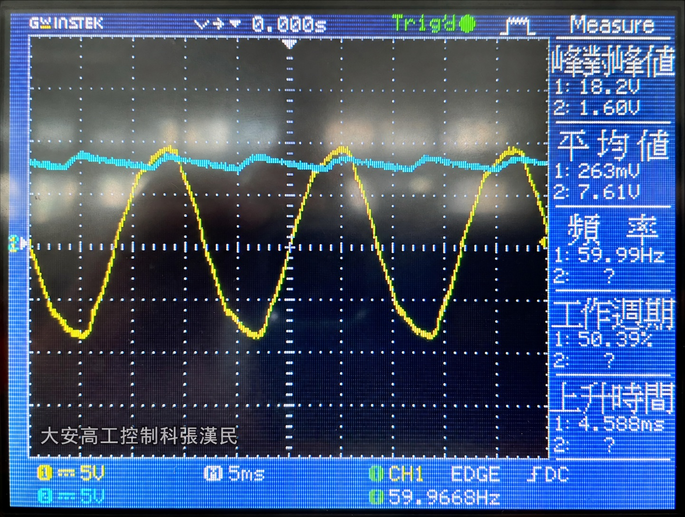

切換為 AC 耦合後，量得 Vr(p-p) ≈ 1.12 V、fr ≈ 120.0 Hz。

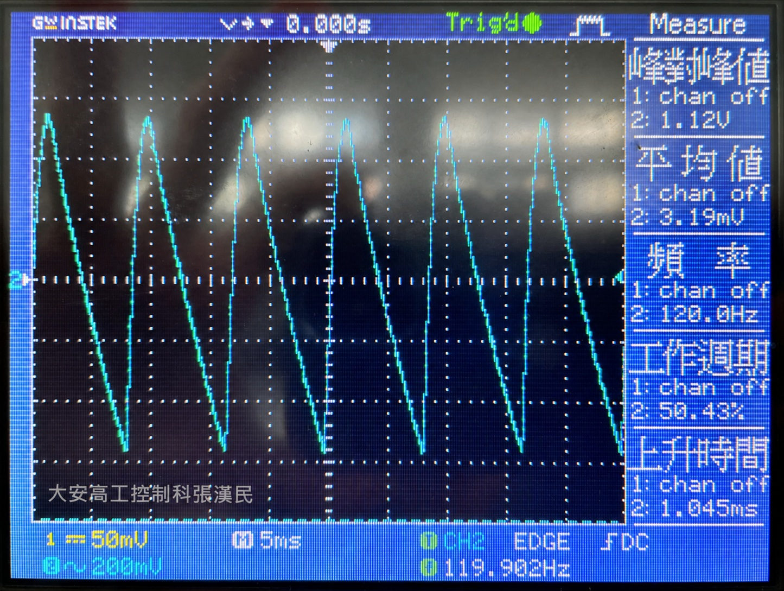

> Vr(rms) ≈ 1.12／(2√3) ≈ 0.323 V
>
> 漣波百分率 ≈ 0.323／7.61 × 100% ≈ 4.25%

#### （二）RL = 10 kΩ，C = 47 μF

負載改為 10 kΩ 後，輸出平均值提高至約 8.15 V。因負載電流減小，波峰間電容的放電量也隨之減少。

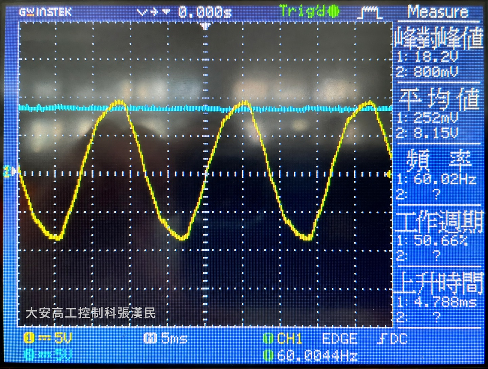

AC 耦合畫面量得 Vr(p-p) ≈ 0.156 V，但自動量測顯示 fr ≈ 130.2 Hz，較理論值 120 Hz 偏高，可能來自示波器自動量測對含雜訊鋸齒波的判讀誤差；應以波形週期（約 8.3 ms）換算，頻率記為約 120 Hz，並以電源頻率交叉確認。

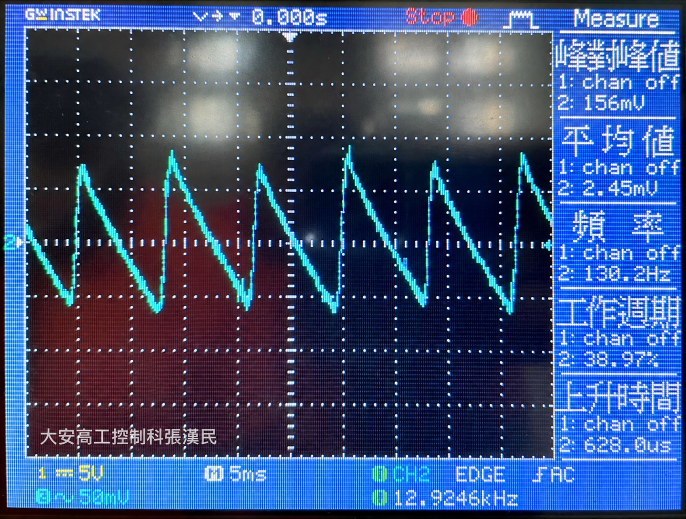

> Vr(rms) ≈ 0.156／(2√3) ≈ 0.0450 V
>
> 漣波百分率 ≈ 0.0450／8.15 × 100% ≈ 0.552%

RL 由 1 kΩ 增加至 10 kΩ 後，Vr(p-p) 約降為原來的 14%，實測趨勢與 r ∝ 1／RL 一致。

**教師示範／參考結果**

| RL | Vdc | Vr(p-p) | Vr(rms) | 漣波頻率 | 漣波百分率 |
|---:|---:|---:|---:|---:|---:|
| 1 kΩ | 7.61 V | 1.12 V | 0.323 V | 約 120 Hz | 4.25% |
| 10 kΩ | 8.15 V | 0.156 V | 0.0450 V | 約 120 Hz | 0.552% |

## 七、實習三：橋式全波整流濾波電路

### 7-1　輸出直流與漣波量測

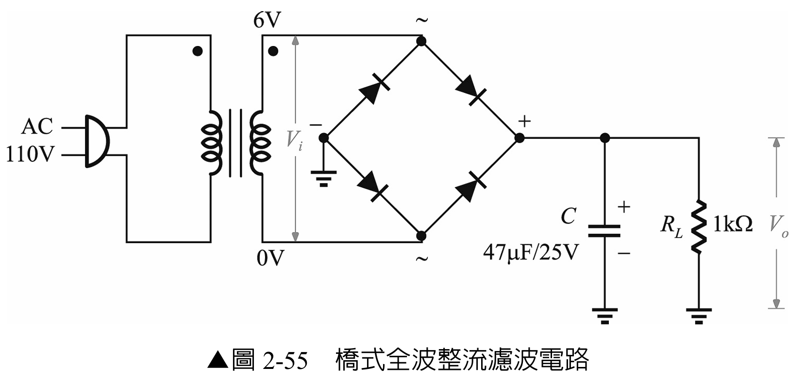

#### 實作前分析

橋式整流使用變壓器 0-6 V 端子，每個半週均有兩顆二極體串聯導通，因此最高輸出約為：

> Vm = 6√2 ≈ 8.48 V
>
> V′m ≈ Vm − 2VD ≈ 8.48 − 1.4 = 7.08 V

橋式整流將輸入負半週翻轉成正向輸出，未濾波輸出的頻率約為 120 Hz；接上 C = 47 μF 與 RL = 1 kΩ 後，電容在每個全波波峰附近充電，其餘時間向負載放電。

其中 0.636 × 7.08 ≈ 4.50 V 是「未接電容時」的平均值對照，不可直接當成濾波後的平均輸出。接上電容後，以 IL ≈ 6～7 mA、C = 47 μF 估得 Vr(p-p) ≈ 1.1～1.2 V，再由濾波後平均值近似式得到 Vdc ≈ 6.5 V。輸出頻率約為 120 Hz，週期約為 8.3 ms；數值均為上電前的量級預估，正式比較應代入實測輸入電壓。

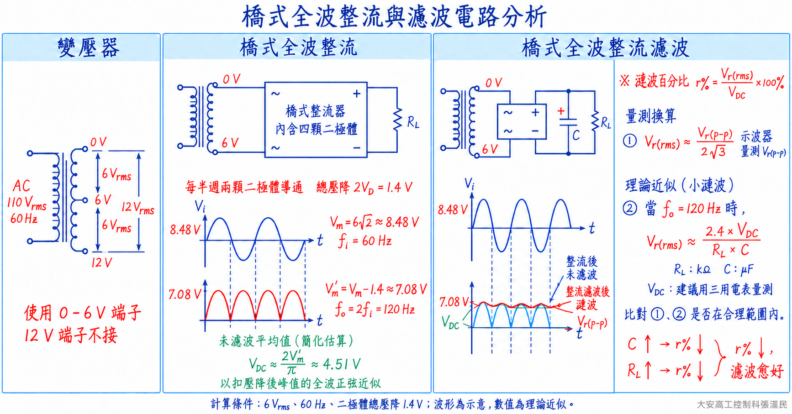

1. 關閉電源，確認橋式整流器的 `~`、`+`、`−` 端，再接 C = 47 μF／25 V 與 RL = 1 kΩ。
2. 通電前再次確認電容正端接橋式 `+`、負端接橋式 `−`。
3. 若先前電路已通電，必須先關閉電源，並以電表確認電容電壓已降至 1 V 以下，才能變更整流接線。

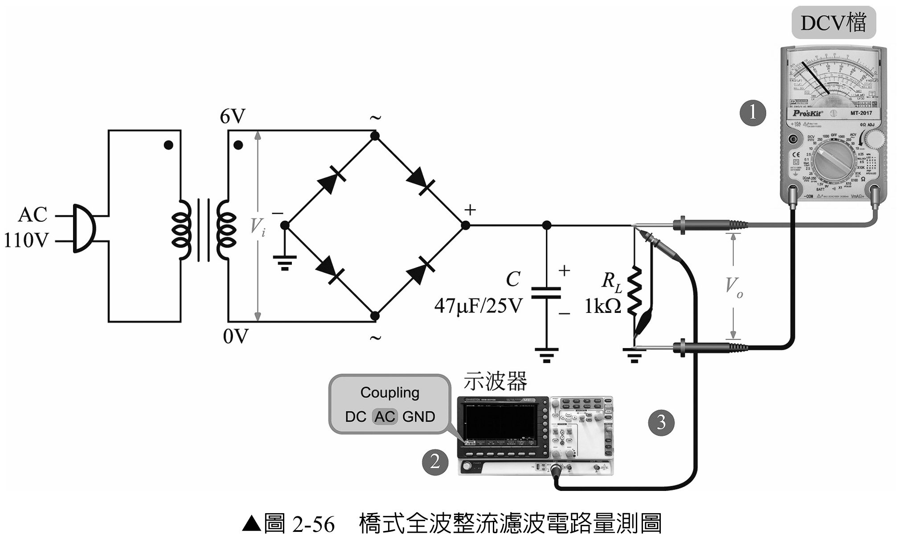

4. 用萬用電表 DCV 檔跨接 RL，量測 Vdc。
5. 示波器接地夾接橋式負輸出 `−`，探棒尖端接正輸出 `+`。
6. 先以 DC 耦合確認總輸出，再切換 AC 耦合量測 Vr(p-p)；不得在通電狀態移動接地夾。
7. 算出 Vr(rms) 與漣波百分率，並與半波整流濾波器比較。

**學生實作紀錄表**

| 整流方式 | RL | C | Vdc | Vr(p-p) | Vr(rms) | 漣波頻率 | 漣波百分率 |
|---|---:|---:|---:|---:|---:|---:|---:|
| 半波 | 1 kΩ | 47 μF |  |  |  |  |  |
| 橋式全波 | 1 kΩ | 47 μF |  |  |  |  |  |

### 7-2　實作結果與計算

先以濾波前波形確認輸入與橋式整流器的工作狀態。輸入為約 60 Hz、18.0 Vp-p 的正弦波；橋式整流後的輸出保持同一極性，波形頻率約為 119.5 Hz。此處兩張圖是濾波前的基準波形，不是接上電容後的 Vdc 波形。

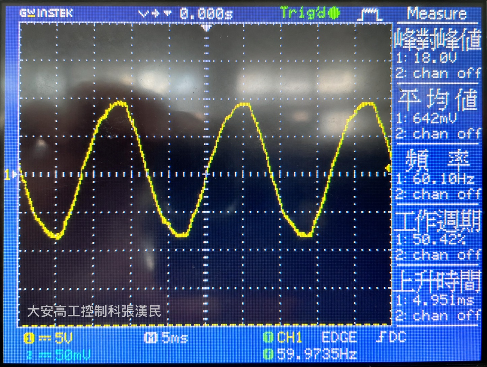

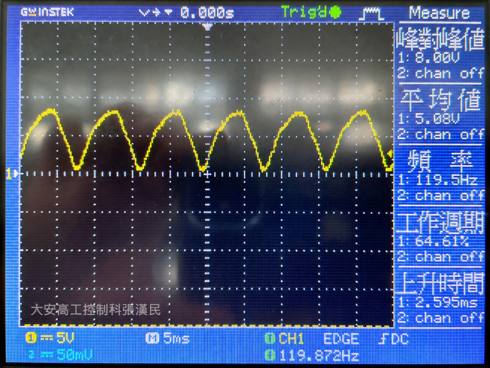

接上 47 μF 電容及 1 kΩ 負載後，將示波器切換為 AC 耦合，量得 Vr(p-p) ≈ 1.00 V、fr ≈ 120.1 Hz。鋸齒狀波形顯示電容在波峰附近快速充電，之後經負載逐漸放電。

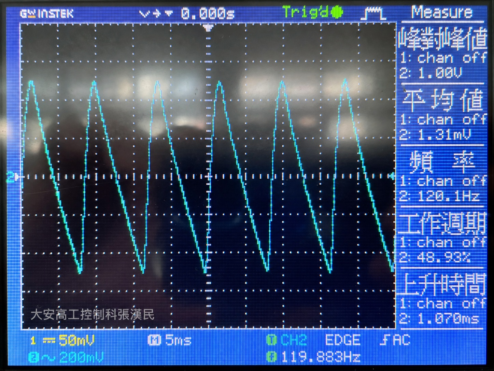

> Vr(rms) ≈ 1.00／(2√3) ≈ 0.289 V
>
> 漣波百分率 = 0.289／Vdc × 100%

漣波圖採 AC 耦合，畫面中的平均值接近 0 V，不能當成輸出直流電壓。應將萬用電表量得的 Vdc 填入上式及比較表，再求漣波百分率。已量得的 Vr(p-p) 約為同條件半波電路的 48%，且頻率約為兩倍，符合全波整流縮短電容放電時間、降低漣波的預期。

**教師示範／參考結果**

| 整流方式 | RL | C | Vdc | Vr(p-p) | Vr(rms) | 漣波頻率 | 漣波百分率 |
|---|---:|---:|---:|---:|---:|---:|---:|
| 半波 | 1 kΩ | 47 μF | 7.52 V | 2.09 V | 0.603 V | 59.81 Hz | 8.02% |
| 橋式全波 | 1 kΩ | 47 μF | 待補量 | 1.00 V | 0.289 V | 120.1 Hz | 待計算 |

> **待完成量測：** 橋式漣波圖未包含濾波後的 Vdc。請以萬用電表 DCV 檔補量後，代入 0.289／Vdc × 100% 求得漣波百分率；不可用 AC 耦合畫面接近 0 V 的平均值代替。

## 八、結果整理與討論

1. 為什麼量測 Vdc 使用 DCV 或 DC 耦合，而量測微小漣波常用 AC 耦合？
2. 為什麼全波整流在相同 RL 與 C 下的漣波小於半波整流？
3. C 增大與 RL 增大都會降低漣波，兩者對負載能力與元件應力的影響有何不同？
4. 若電解電容反接，可能出現哪些危險？通電前應如何發現？
5. 為何實測漣波不一定完全符合三角波近似公式？請從二極體壓降、變壓器內阻、電容誤差、負載誤差及示波器量測誤差討論。

## 九、完成檢核

- [ ] 每次更換電容、負載或整流方式前均已關閉電源並確認放電。
- [ ] 電解電容極性與 25 V 額定電壓均已確認。
- [ ] DC 耦合、AC 耦合及探棒倍率均有記錄。
- [ ] 各表均包含 Vdc、Vr(p-p)、Vr(rms) 與漣波百分率。
- [ ] 能以充電頻率說明半波與全波漣波差異。
- [ ] 能說明「降低漣波」與「二極體峰值電流增加」之間的取捨。
- [ ] 實習結束後已關閉電源並確認電容放電。
