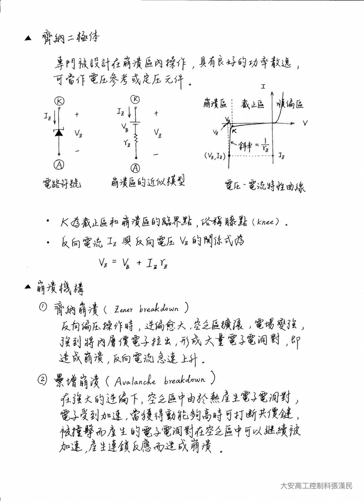
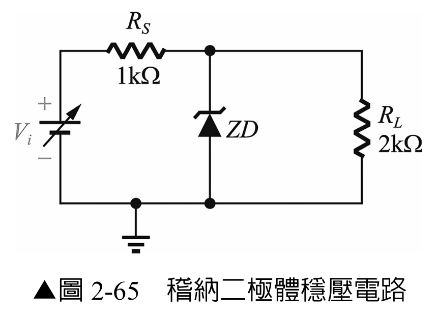
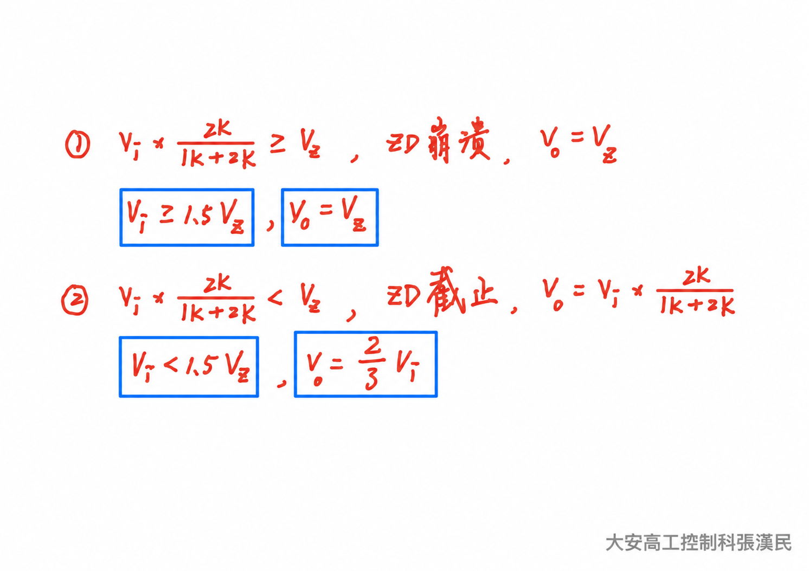
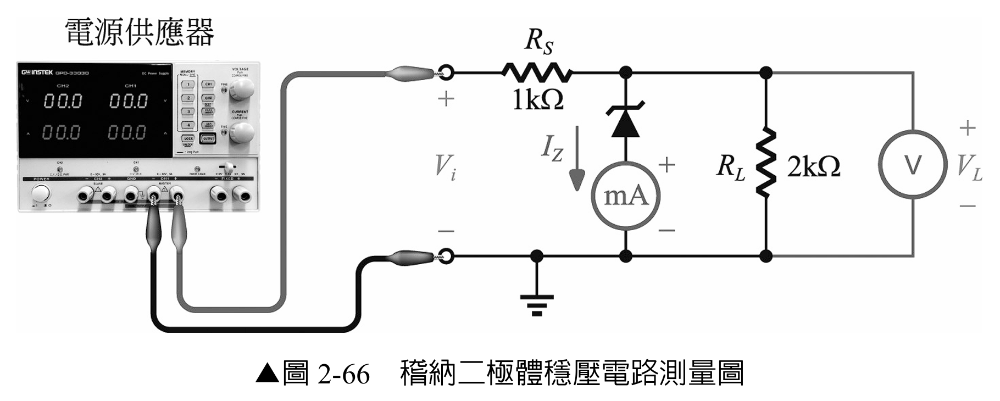
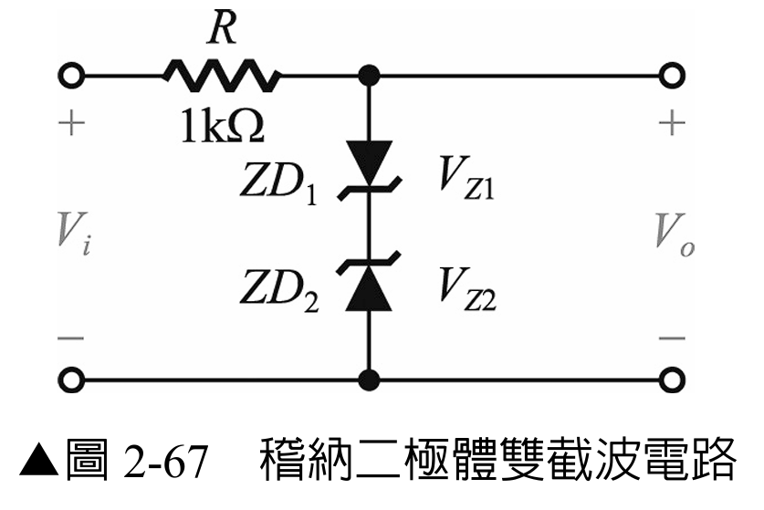
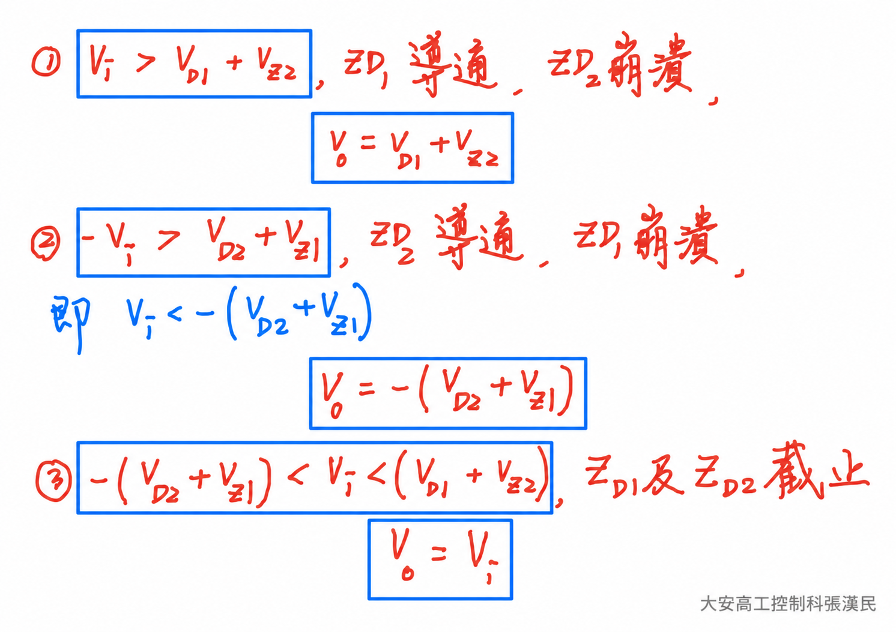
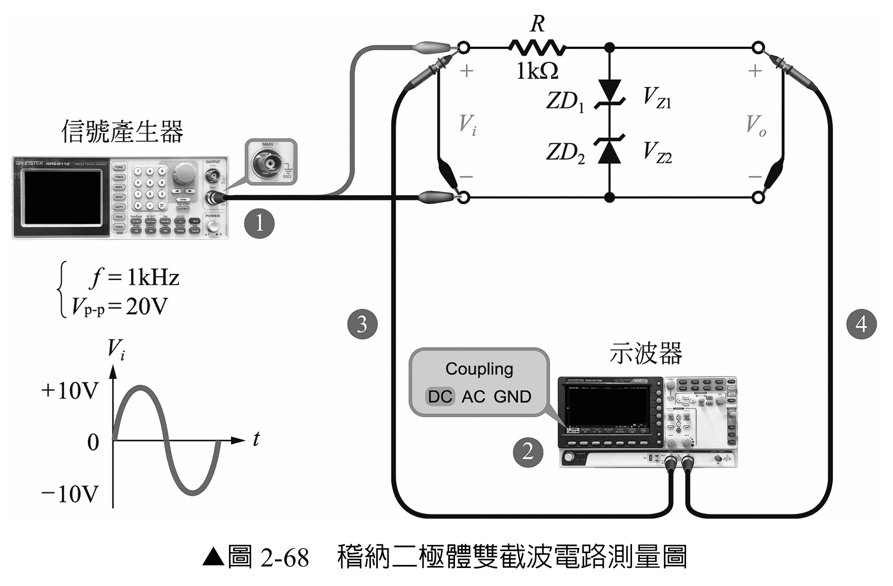
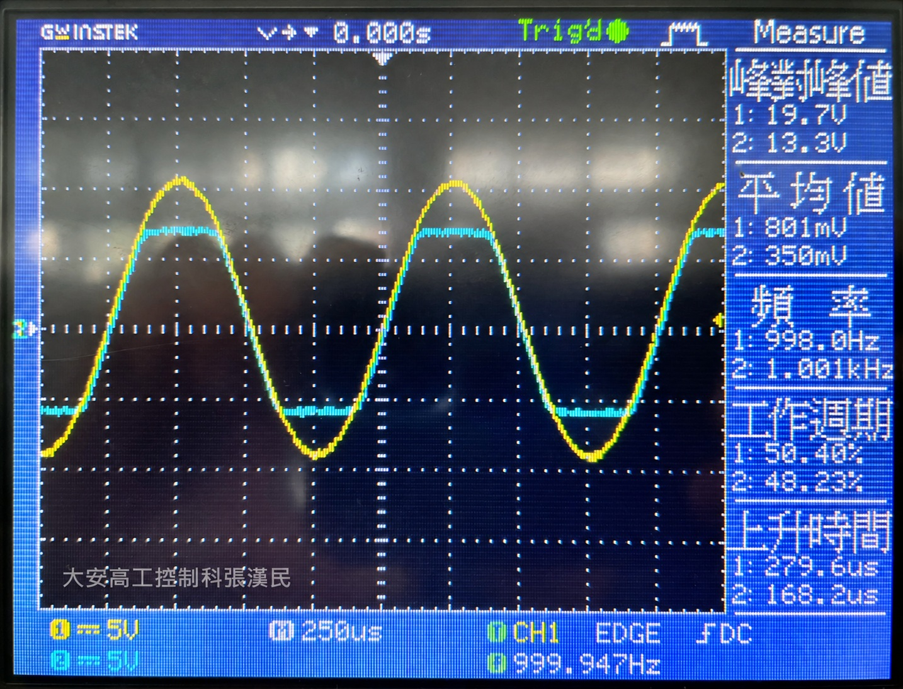
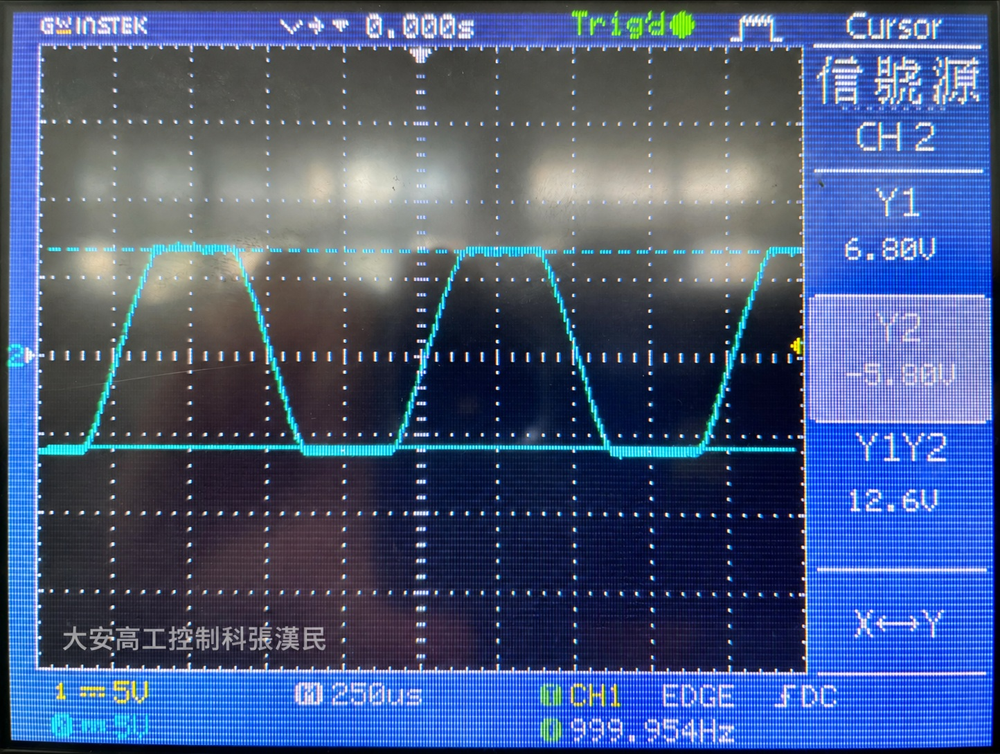

# 實習 2-5　稽納二極體

> 原始教材：[實習2-5.pdf](實習2-5.pdf)　｜　建議課時：3 節

## 一、學習目標

完成本實習後，學生應能：

1. 說明稽納二極體在順向偏壓、逆向截止與逆向崩潰區的工作特性。
2. 分析串聯限流電阻、負載與稽納二極體之間的電流關係。
3. 量測輸入電壓變動時的負載電壓、稽納電流與消耗功率。
4. 判斷穩壓開始條件及元件是否超過額定功率。
5. 使用兩顆反向串接的稽納二極體完成不對稱雙截波電路。

## 二、器材與元件

| 類別 | 品名與規格 | 數量 |
|---|---|---:|
| 電源 | 可調式直流電源供應器 | 1 |
| 信號源 | 函數波信號產生器 | 1 |
| 元件 | 6.2 V 稽納二極體，額定功率至少 0.5 W | 1（實習一、二共用，做完實習一再做實習二） |
| 元件 | 5.1 V 稽納二極體，額定功率至少 0.5 W | 1（實習二用） |
| 元件 | 1 kΩ／0.25 W 電阻 | 2（1 顆限流、1 顆供 5-3 負載變動用） |
| 元件 | 2 kΩ／0.25 W 負載電阻 RL | 1 |
| 元件 | 4.7 kΩ／0.25 W 負載電阻 | 1（5-3 負載變動用） |
| 儀器 | 雙軌示波器與探棒 | 1 組 |
| 儀器 | 數位萬用電表 | 2（或依序量測） |
| 其他 | 麵包板與接線 | 1 組 |

## 三、工作原理
#### 特性曲線與崩潰區模型

下圖整理稽納二極體的電路符號、崩潰區近似模型、電壓－電流特性曲線與兩種崩潰機構。閱讀時先找出截止區與崩潰區交界的膝點，再對照動態電阻 rZ，理解實際穩壓電壓仍會隨電流略微變動。

### 3-1　稽納二極體的三種工作狀態

- **順向偏壓：** 特性近似一般矽二極體，順向壓降通常約 0.6–0.7 V。
- **逆向偏壓但未達崩潰電壓：** 僅有很小漏電流，近似開路。
- **逆向偏壓達稽納電壓 VZ：** 進入崩潰區後，端電壓在一定電流範圍內維持接近 VZ。

稽納二極體必須與限流電阻串聯使用。進入崩潰區並不代表電流可以無限制增加；若超過額定功率，元件仍會損壞。

### 3-2　並聯式穩壓電路

在穩壓狀態下，負載電壓近似：

> VL ≈ VZ

限流電阻、負載與稽納二極體的電流關係為：

> IS = (Vi − VL)／RS
>
> IL = VL／RL
>
> IZ = IS − IL

稽納二極體消耗功率（以下 VZD 表示二極體實際逆向端電壓）：

> PZ = VZDIZ

穩壓區的理論預測可用 VZD ≈ VZ，本實習即 PZ ≈ 6.2IZ；尚未崩潰時，理想模型令 IZ ≈ 0，故 PZ ≈ 0。實測時應使用實際端電壓，不能在所有工作區一律代入 6.2 V。

依圖 2-66，VL 包含二極體與串聯電流表的壓降，因此 PZ ≈ VLIZ 是忽略電流表壓降的近似；若需較精確的功率，應將電壓表直接跨接二極體兩端量測 VZD。

只有當 IS 足以同時供應負載電流與最低稽納電流時，二極體才會進入有效穩壓區。若計算得到 IZ ≤ 0，表示稽納二極體尚未崩潰，不能直接令 VL = VZ；此時可先用分壓近似：

> VL ≈ ViRL／(RS + RL)

### 3-3　輸入與負載變動的影響

- Vi 上升時，多出的電流主要由稽納二極體吸收，VL 僅小幅變化。
- Vi 下降至不足以維持 IZ 時，稽納二極體離開崩潰區，VL 隨輸入下降。
- RL 減小時，IL 增大、IZ 減小；負載過重時會失去穩壓。
- RL 增大或開路時，更多電流流入稽納二極體，必須重新檢查 PZ。

### 3-4　雙截波電路

兩顆不同 VZ 的稽納二極體反向串接時，一個極性由其中一顆逆向崩潰、另一顆順向導通；另一極性則交換角色。因此兩側截波準位約為：

> 截波準位大小 ≈ VZ + VF

使用 5.1 V 與 6.2 V 稽納二極體時，兩側約在 5.8 V 與 6.9 V 附近截波；正、負側分別由哪一顆決定，應依圖 2-67 的實際方向判讀。1 kΩ 電阻用來限制截波導通時的電流。

## 四、安全與量測規範

> **警告：** 電源供應器必須先關閉輸出並設定電流上限。本穩壓電路 RS = 1 kΩ、最高 Vi = 18 V，理論串聯電流約不超過 12 mA；建議電流上限先設為 15 mA。若供應電流超過約 13 mA、稽納二極體明顯升溫、讀值跳動或有異味，立即關閉輸出。

> **注意：** 不可將稽納二極體直接跨接電源而省略 RS。每次提高 Vi 前，先確認 IZ 與 PZ 未超過資料手冊額定值。

> **注意：** 電流表必須串聯在稽納支路，且由最高電流檔開始；電壓表並聯於 RL。禁止把電流表直接並聯在電源或元件兩端。

> **注意：** 示波器 CH1、CH2 的接地端彼此相通。雙截波電路的信號產生器與示波器必須共接電路地，接線或移動探棒前先關閉輸出。

## 五、實習一：稽納二極體穩壓電路

### 5-1　電路分析與理論預測

<table>
<tr>
<td></td>
<td></td>
</tr>
</table>

*左：圖 2-65　稽納二極體穩壓電路；右：分壓與崩潰條件推估。*

[放大電路圖](assets/實習2-5/圖2-65-稽納二極體穩壓電路.png)　｜　[放大推估圖](assets/實習2-5/2-5工作一：稽納二極體穩壓電路推估值.png)

#### 實作前分析

上圖右側以 RS = 1 kΩ、RL = 2 kΩ 推導工作區判定。圖中的 Vo 即本實習的 VL：尚未崩潰時，VL ≈ (2／3)Vi；當分壓達到 VZ = 6.2 V 時，理想崩潰起點為 Vi ≈ 1.5VZ = 9.3 V。

> **判讀提醒：** 9.3 V 是理想模型中 IZ 剛好為零的邊界；實際要維持有效穩壓，仍需提供足夠的稽納電流，不能把此邊界直接視為可靠穩壓的最低輸入。

例如 Vi = 10 V 時，理想 IS = 3.8 mA、IL = 3.1 mA，故 IZ 僅約 0.7 mA。此時實際電壓是否已接近標稱 6.2 V，須依元件的低電流特性與實測判斷。先完成下表，再進行接線與量測；表中穩壓區功率採 PZ ≈ 6.2IZ 預測。

| Vi | 預測 VL | IS | IL | 預測 IZ | 預測 PZ | 判定理由 |
|---:|---:|---:|---:|---:|---:|---|
| 2 V |  |  |  |  |  |  |
| 6 V |  |  |  |  |  |  |
| 10 V |  |  |  |  |  |  |
| 14 V |  |  |  |  |  |  |
| 18 V |  |  |  |  |  |  |

> **判讀重點：** 低輸入電壓時，VL 不會憑空成為 6.2 V；只有輸入與串聯電流足夠時才進入稽納崩潰區。進入穩壓後，VL 仍可能因動態電阻、溫度與元件公差而略有變化。

### 5-2　接線與量測紀錄

1. 確認電源輸出關閉，將 Vi 調回 0 V，電流上限設為 15 mA。
2. 依圖 2-65 接妥 RS = 1 kΩ、RL = 2 kΩ 與 VZ = 6.2 V 的稽納二極體。
3. 稽納二極體陰極接輸出正端、陽極接共同地，使其工作於逆向偏壓。
4. 通電前用電阻檔檢查輸出正端與地之間沒有意外短路。注意表筆反接時稽納二極體順偏導通，電阻檔會顯示低阻屬正常；重點是排除接近 0 Ω 的金屬短路。

5. 電流表串聯於稽納支路量測 IZ；電壓表跨接 RL 量測 VL。
6. 依序將 Vi 調為 2 V、6 V、10 V、14 V、18 V。每次均由較低值緩慢上調，讀值穩定後立即記錄。
7. 忽略電流表壓降時，以實測值計算 PZ ≈ VLIZ；若另量得二極體實際端電壓，則用 PZ = VZDIZ。電流以 mA 代入時，所得功率單位為 mW。
8. 比較各點的 VL 與 IZ，找出輸出逐漸趨於穩定的範圍。上述五點用來觀察整體趨勢；若需細查轉折，可在 8～12 V 間以 0.5 V 間隔補量，記錄 Vi、VL、IZ，必要時再縮小間隔。以輸出變化趨緩及元件資料判讀有效穩壓區，不把理想 9.3 V 邊界直接當成實際穩壓開始點。

| Vi | 2 V | 6 V | 10 V | 14 V | 18 V |
|---|---:|---:|---:|---:|---:|
| VL 實測值 |  |  |  |  |  |
| IZ 實測值 |  |  |  |  |  |
| PZ 計算值 |  |  |  |  |  |
| 工作區判定 | 未穩壓／穩壓 | 未穩壓／穩壓 | 未穩壓／穩壓 | 未穩壓／穩壓 | 未穩壓／穩壓 |

### 5-3　負載變動對穩壓的影響

若教師安排負載變動實驗，可在固定 Vi = 14 V 下依序更換 RL。每次更換前必須關閉輸出；無負載時將電壓表改跨輸出兩端量測。

| RL | VL | IL | IZ | PZ | 是否穩壓 |
|---:|---:|---:|---:|---:|---|
| 1 kΩ |  |  |  |  |  |
| 2 kΩ |  |  |  |  |  |
| 4.7 kΩ |  |  |  |  |  |
| 無負載 |  | 0 mA |  |  |  |

在 Vi = 14 V、RL = 1 kΩ 時，理想 IZ = (14 − 6.2)／1 kΩ − 6.2／1 kΩ = 1.6 mA，仍可能維持穩壓。因此本組操作主要觀察負載加重時 IZ 減少、負載減輕時 IZ 增加的趨勢，不預設一定會失去穩壓。

**選做：觀察失去穩壓。** 關閉輸出，保留 RS = 1 kΩ，另用第 2 顆 1 kΩ 電阻作負載，將 Vi 設為 10 V 後再通電。理想分壓 VL = 10 × 1／(1 + 1) = 5 V，低於 6.2 V，故稽納支路近似截止。記錄 VL = ＿＿＿＿ V、IZ = ＿＿＿＿ mA，並與 14 V、1 kΩ 的結果比較。

## 六、實習二：稽納二極體雙截波電路

### 6-1　接線與截波準位預測

<table>
<tr>
<td></td>
<td></td>
</tr>
</table>

*左：圖 2-67　稽納二極體雙截波電路；右：三種工作狀態與輸出準位推估。*

[放大電路圖](assets/實習2-5/圖2-67-稽納雙截波電路.png)　｜　[放大推估圖](assets/實習2-5/2-5工作二：稽納二極體雙截波電路推估值.png)

雙截波推估圖文字較密，閱讀時可開啟原圖放大；列印若不易辨識，可將原圖另以單頁列印，配合左右對照圖使用。

1. 確認信號產生器輸出關閉，依圖接妥 R = 1 kΩ、ZD1 = 5.1 V 與 ZD2 = 6.2 V。
2. 由二極體色環與電路圖確認兩顆稽納二極體為反向串接。
3. 在紙上分別標出輸入正半週、負半週時的電流方向，判斷哪一顆逆向崩潰、哪一顆順向導通。
4. 以 VZ + 0.7 V 預測兩側截波準位，並記下預測極性。

#### 實作前分析

上圖右側將雙截波分成正側截波、負側截波及未截波三種情況。依圖中方向，正側由 ZD1 順向導通、ZD2 逆向崩潰，Vo ≈ 0.7 + 6.2 = +6.9 V；負側則交換角色，Vo ≈ −(0.7 + 5.1) = −5.8 V。輸入位於兩個截波準位之間時，稽納串接支路近似不導通，Vo ≈ Vi。

### 6-2　示波器量測

1. 信號產生器設為 1 kHz、0 V DC Offset 的正弦波，先設定較小振幅並保持輸出關閉；本實習目標為電路輸入端實測 20 Vpp。
2. CH1 接 Vi、CH2 接 Vo，兩通道設 DC 耦合，所有接地端接共同地。確認每支探棒的 ×1／×10 開關與示波器通道倍率設定一致，示波器使用高阻抗輸入。
3. 檢查信號產生器的負載顯示設定，具備 High Z 選項時先選用；啟用輸出後由小振幅逐步上調，**以 CH1 在電路輸入端實測達 20 Vpp 為準**。部分儀器若以 50 Ω 負載標示振幅，接高阻抗負載時實際振幅可能接近顯示值的兩倍，不可只依面板數字判定輸入振幅。
4. 調整相同 VOLTS/DIV 與零位，使輸入、輸出波形容易比較。
5. 量測輸出的正峰值與負峰值，而不只記錄 Vpp；觀察兩側截波是否不對稱。

| 波形 | VOLTS/DIV | 正峰值 | 負峰值 | Vpp | TIME/DIV | 週期 T | 頻率 f | 波形觀察 |
|---|---:|---:|---:|---:|---:|---:|---:|---|
| Vi |  |  |  |  |  |  |  | 正弦波 |
| Vo |  |  |  |  |  |  |  | 正、負側於不同準位截波 |

| 截波側 | 理論準位 | 實測準位 | 誤差 | 對應導通組合 |
|---|---:|---:|---:|---|
| 正側 |  |  |  | 一顆逆向崩潰、一顆順向導通 |
| 負側 |  |  |  | 一顆逆向崩潰、一顆順向導通 |

### 6-3　實作結果與判讀

#### （一）輸入與輸出波形比較

黃色 CH1 為輸入正弦波，藍色 CH2 為雙截波輸出；兩通道均為 5 V/div，時間刻度為 200 μs/div。畫面顯示輸入約 19.7 Vpp、輸出自動量測約 13.3 Vpp，頻率皆約 1 kHz。輸出在中間區段跟隨輸入，正、負峰附近則形成平坦區，呈現雙截波效果。

#### （二）以游標量測截波準位

將 CH2 的兩條水平游標分別對準正、負側平坦區。下圖正側游標 Y1 = +6.80 V，兩游標差值為 12.6 V，因此負側準位可由 +6.80 − 12.6 推得約 −5.80 V，與理論預測的 +6.9 V、−5.8 V 接近。

## 七、問題與討論

1. 稽納二極體在順向偏壓與逆向崩潰區的特性有何不同？
2. 當 Vi 從 2 V 上升至 18 V 時，VL、IZ 與 PZ 分別如何變化？
3. 為什麼負載加重可能使穩壓電路失去穩壓？
4. 若 RS 過小，稽納二極體與電源可能承受什麼風險？
5. 為什麼 5.1 V 與 6.2 V 稽納二極體反向串接後，輸出兩側截波準位不相同？

## 八、完成檢核

- [ ] 電源供應器已設定 15 mA 電流上限，所有接線變更均在關閉輸出時完成。
- [ ] 電流表串聯、電壓表並聯，插孔與量程均正確。
- [ ] 每個 Vi 均記錄 VL、IZ、PZ 與工作區。
- [ ] 雙截波量測同時記錄正峰值、負峰值與 Vpp。
- [ ] 能說明穩壓開始條件、負載效應與功率限制。
- [ ] 實習結束後已關閉電源與信號輸出。
